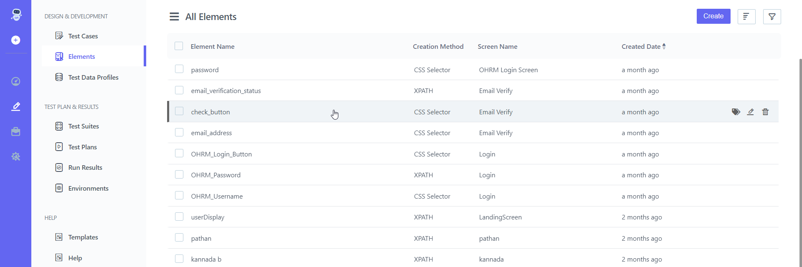
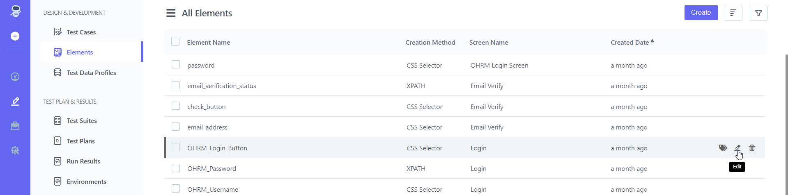
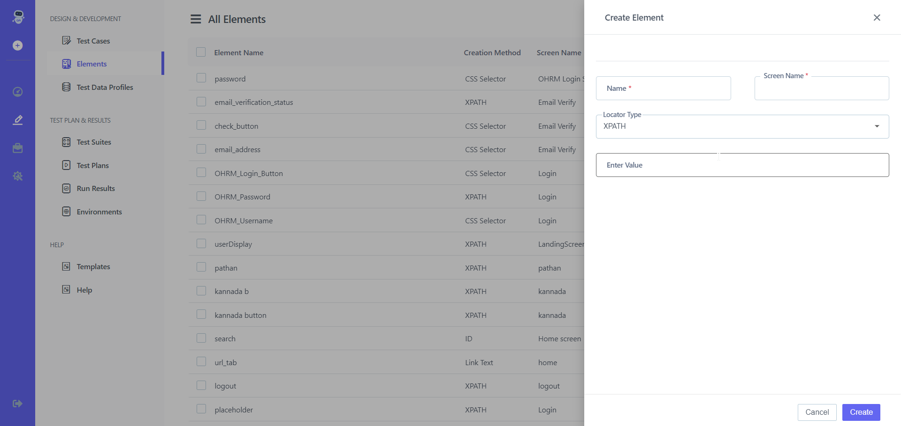

## 10.2 **Edit Element** 

**Steps:** 

1. Go to **Portal** 
2. On the left-hand side There Will Be A **Pencil Icon (Test Development)** Click on it 
3. Choose **Element** From **Design and Development**

4. You can **Edit** the given **Element**
5. On the right-hand side, there is a **Pencil icon ( Edit )** 
6. Click on it 

7. Edit  **Name, Screen name, Locator type, Enter Value**
8. Click on **Create Button** 
