1. Click on Signup

   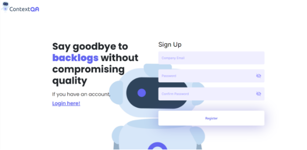

1. Add the details in Signup page and Verify your email popup will appear. Please verify email by navigating to your email address

   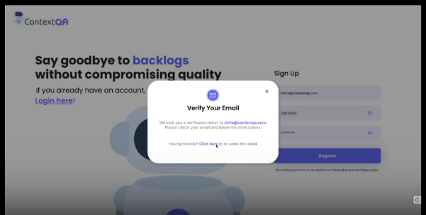

1. Add all the details in Sign in page and click on Login

   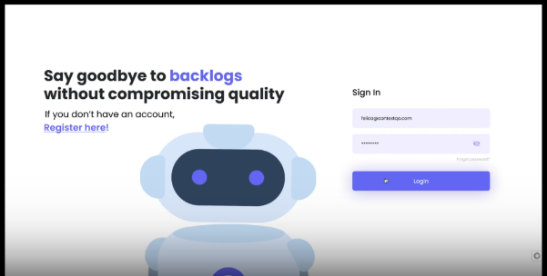

1. Click on the Projects dropdown icon

   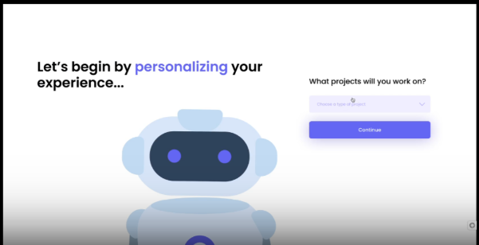

1. Select the Type of Project

   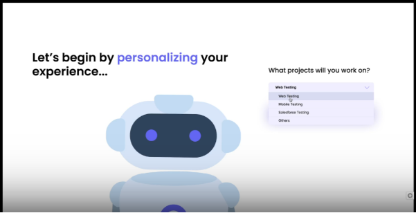

1. Click on Continue

   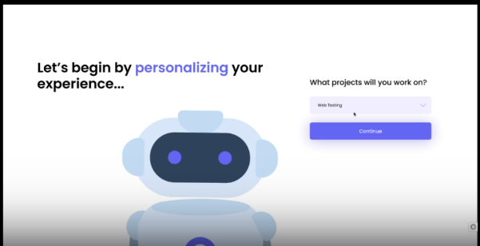

1. Create your first project by giving a name

   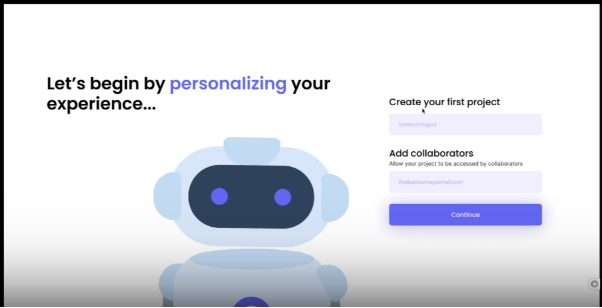

1. Click on Continue

   

1. Click on Install

   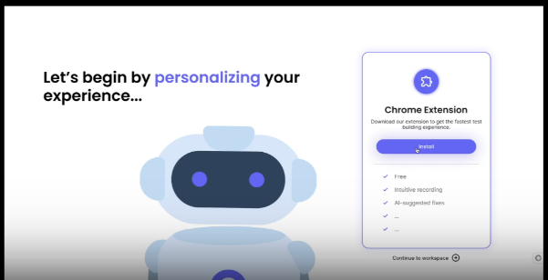

1. You will see a load screen, please wait for 1-2mins

   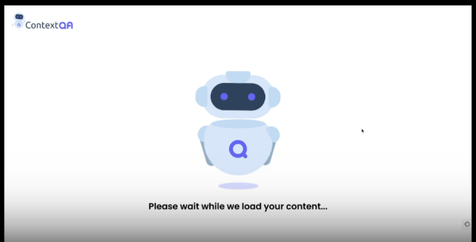

1. Click on Create Test

   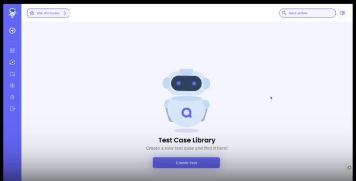

1. List of Existing Tabs will be displayed

   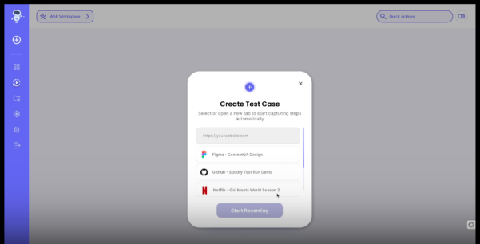

1. Enter the site URL that would like to Test

   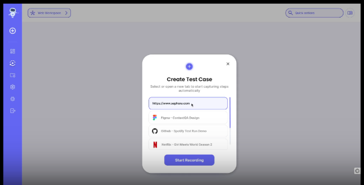

1. Click on Start Recording

   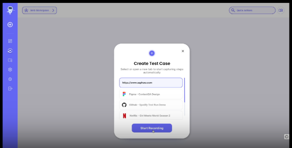

1. Click on Start recording again in the ContextQA extension side

   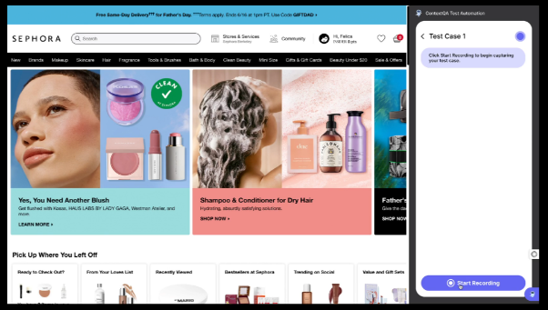

1. You will see the Timer on screen to set it up

   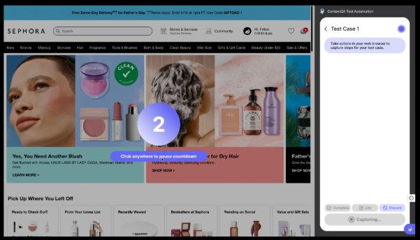

1. Start clicking on the elements on the screen and it will be captured by the recorder

   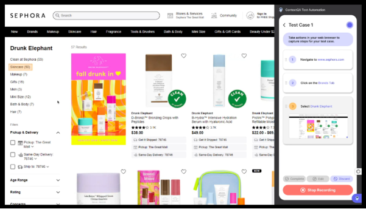

1. Click on Stop Recording

   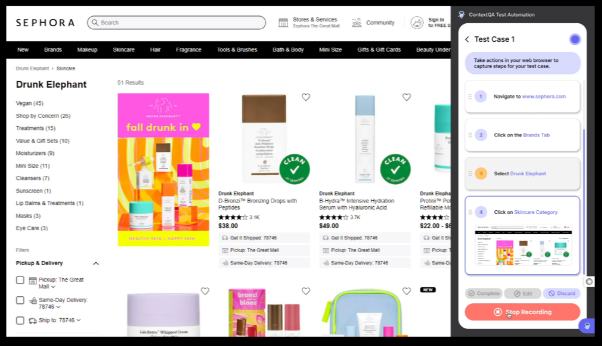

1. Step number with Yellow highlight indicates step needs to be validated

   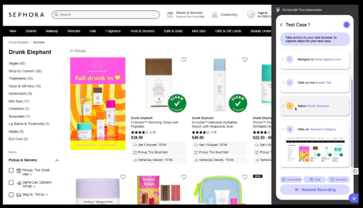

1. Click on the Edit button

   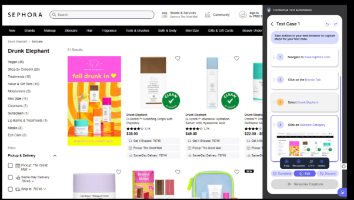

1. Click on **AI fix**, to get automated AI suggestion

   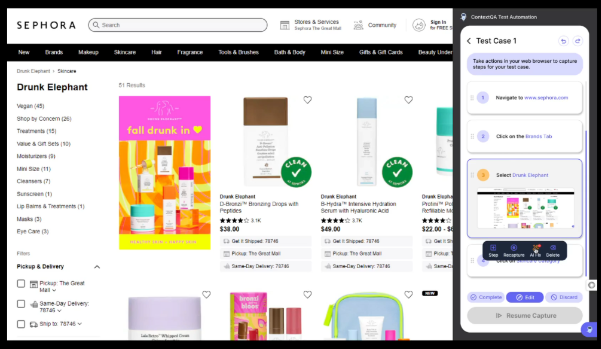

1. Verify the suggestion

   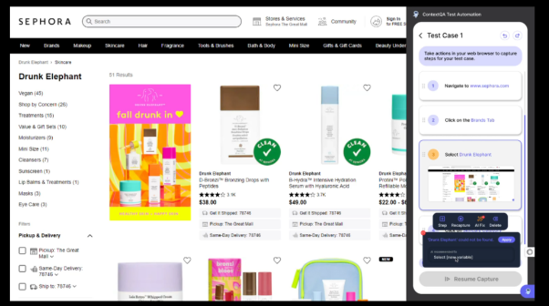

1. Click on Apply

   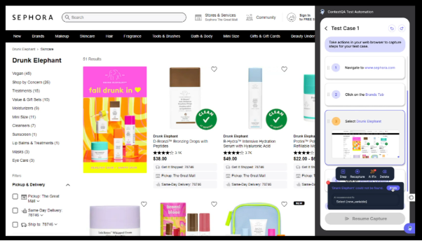

1. Click on Complete

   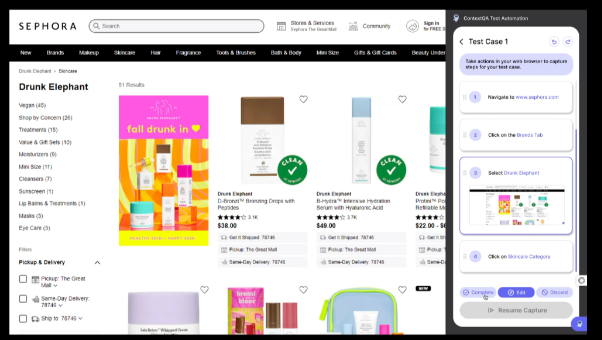

1. Click on Run Test

   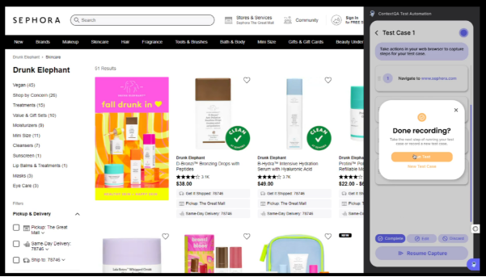

1. Live Execution screen will be displayed

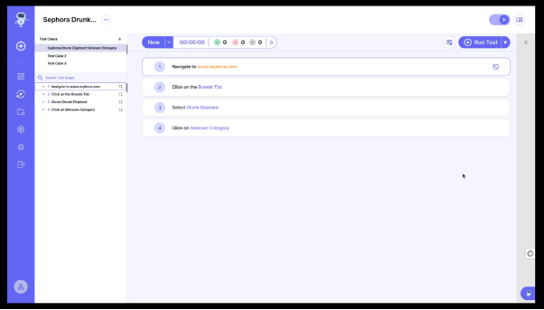
