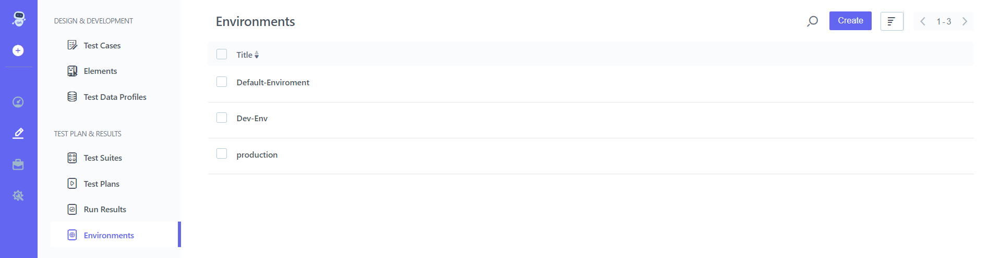
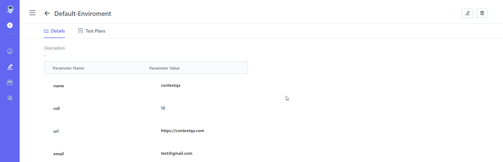

## 9.2. **Edit Environment** 
[**Video**](https://www.youtube.com/watch?v=jLo9UAF1oPs&list=PLfRq0FuuqhRnYtoF6kHsDdZc7ekSgpg6V&index=7)

**Steps:** 

1. Go to **Portal** 
2. On the left-hand side, There Will Be A **Pencil Icon (Test Development)** Click on it 
3. Choose **Environments** From **Test Plan & Result**
4. Select **Environments** From the List 

5. On the right-hand Side There Is **Edit Tab (Pencil icon), Click on it** 
6. **Edit Name, Description, Parameter Name, Parameter value.**
7. Click **on Update Button** 