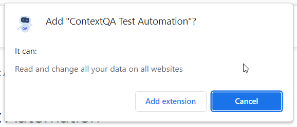
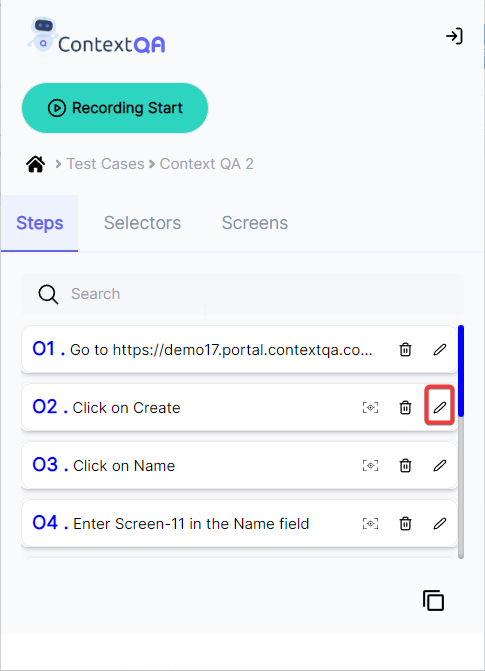
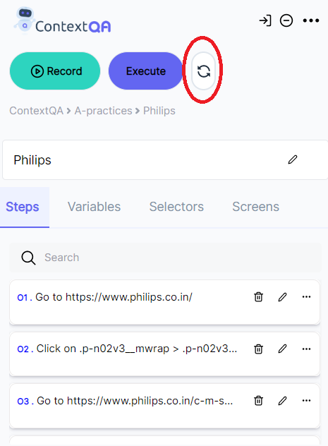
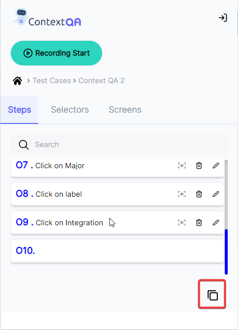

---
sidebar_position: 2
---

##

1. ## Install Chrome Extension 

1. Install the extension from here

<https://chrome.google.com/webstore/detail/contextqa-test-automation/pgadpooodaipbhbchnojijmlkhpamadh/related>

1. Click on ‘**Add to Chrome**’ button on the right as shown below.

1. Click on ‘**Add Extension’** from the pop up as shown**.**

1. Success message will be shown via pop-up on the right as shown in the screenshot below.

## 1.0 Login Chrome Extension 

Video   

Steps: 

1. Go to Extension (put the sign)
1. Pin the ContextQA icon (put the icon)
1. Click on (Icon) the **Home** screen will open.

1. Click on **Login**  button, it will redirect the user to <https://accounts.contextqa.com>

1. Enter Your **Organisation.**
1. Enter your **Username & Password** 
1. Click on **Login.****  

**Case II**

**For Signin Up  Kindly refer to ContextQA Portal Documentation.**

<https://docs.google.com/document/d/1Fe9R_lDLDq6RCeugUXrxTSkvSrt8_ibCXzTZvJJeNRU/edit#heading=h.42hfbyysqogf>

## 1.1 Select the Test Suite and Test Case

1. Click on **Extension icon.**
1. On the home page, Select **Test Suite List** or **Test Case** **List**.

## 2. Create a Test Case in Chrome Extension  
How to create- [**Video**](https://www.youtube.com/watch?v=01eY1n4bZUA&list=PLfRq0FuuqhRkB4nAD6NYbmzSYoi0yA8OG&index=2)

1. Click on **Extension icon.** 
1. **Test Cases** can be created from both - **Test Case List and Test Suite List** 
1. Click on **Test Case List.** 
1. There is a **Create** button as shown in the screenshot below 

1. Click on **Create** button 
1. Add **Test Case Title, Description, and Tags** as shown in the screenshot below.

1. Click on **Save.**
**

## 3. Edit Test Case in Extension 
How to Edit- [Video](https://www.youtube.com/watch?v=GTvMP-7LXfs&list=PLfRq0FuuqhRkB4nAD6NYbmzSYoi0yA8OG&index=10)

Steps

1. Click on **Extension icon.**  
1. Go to **Test Case List**
1. Test case list will open.
1. Click on** the **Pencil icon** as shown in the screenshot above

` `

1. Edit the **Test Case Title, Description, and Tags** as Shown in the screenshot below.

1. Click on **Update.** 

## 4. Delete Test Case in Extension 
[**Video** ](https://www.youtube.com/watch?v=6ihdpNnEuT8&list=PLfRq0FuuqhRkB4nAD6NYbmzSYoi0yA8OG&index=11)

**Steps**

1. Click on **Extension icon.**  
1. Go to **Test Case List**
1. Test case list** will open.
1. Search for the respective **Test Case**.
1. Click on **Delete Icon** as shown in the screenshot below

## 5. **Start and Stop recording in Extension** 
[**Video**](https://www.youtube.com/watch?v=vJPo1xnzNOw&list=PLfRq0FuuqhRkB4nAD6NYbmzSYoi0yA8OG&index=4)

1. Click on **Extension icon.** 
1. Click on **Test Case List**
1. The test case** list will open.
1. Click on your **Test Case.** 
1. Click on** the **Recording Start** button** as shown in the screenshot.

1. Once done, click on** the **Recording Stop** Button.

## 6. **Edit Test Case Steps** 

1. Click on **Extension icon.** 
1. Go to **Test Case List**
1. **The test case** list will open 
1. Click on **Test Case** 
1. Click on **Record Button** 
1. Click on the **Finish** button after recording 
1. There will Be **Edit Button** in the Test Case steps as shown In the screenshot below 
1. 
1. Click on the **Edit** button 
1. Enter **Metadata, Specs** as shown in the screenshot below.
1. 
1. Click on the **save button** 

## 7. Delete Test Case Steps 

1. Go to **Extension** 
1. Go to the **Test Case list**
1. **The test case list** will open
1. Click on **Test Case** 
1. Click on the **Record** button 
1. Click on the **finish** button after recording 
1. There will be a **Delete** button as shown in the screenshot below 
1. 
1. Click on the **delete button.** 

## 8. Restart the Recording 
##
[Video ](https://www.youtube.com/watch?v=snViFf6ZDAQ&list=PLfRq0FuuqhRkB4nAD6NYbmzSYoi0yA8OG&index=6)

Steps

1. Go to **Extension** 
1. Go to the **Test Case list**
1. **The test case list** will open
1. Click on **Test Case** 
1. Click on the **record** button 
1. Click on the **finish** button after recording 
1. There Is a **restart** button as shown in the screenshot below. 
1. 
1. Click on the **restart,** To restart the recording 

## 9. **Go to the Home Page** 

1. In Chrome Extension
1. On the left-hand side, there is a Home Page icon in given places, **Test Suite or Test Case list, and Test Steps List.**
1. ` `****

## 10. **Highlighter Feature**

[Video](https://www.youtube.com/watch?v=N9I_dhvI7Xk&list=PLfRq0FuuqhRkB4nAD6NYbmzSYoi0yA8OG&index=17)

1. Go to **Extension** 
1. Create a new **Test Case**
1. Click on **Test Case** 
1. Click on the **record** button 
1. Click on the **finish** button after recording 
1. Go to created **Test case** 
1. In **Test Steps**, there is a selector button. If we click on the selector button it will select the option we recorded in Extension. 
1. 

##
## 11. Copy Test Steps
[**Video**](https://www.youtube.com/watch?v=VEAAcP9T0mE&list=PLfRq0FuuqhRkB4nAD6NYbmzSYoi0yA8OG&index=15)

1. Go to **Extension** 
1. Create a new **Test Case**
1. Click on **Test Case** 
1. Click on the **record** button 
1. Click on the **Recording stop** button after recording
1. Click on **Copy** button at the bottom right corner to copy all test steps

