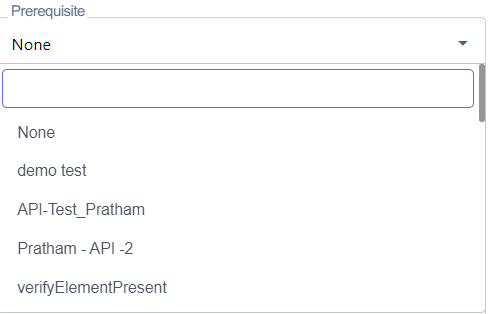
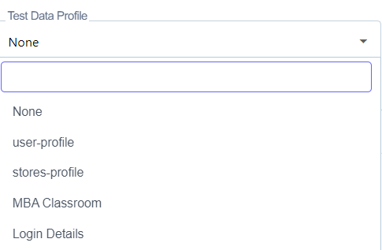

# Index

# Prerequisites:

Sign-up URL: <https://accounts.contextqa.com> 

Chrome Extension URL: [Link](https://chrome.google.com/webstore/detail/contextqa-test-automation/pgadpooodaipbhbchnojijmlkhpamadh)

# 1. How To Login Portal 

**Steps:**

1. Go to **Portal**
1. The login page will be displayed

1. Enter **Username** 
1. Enter **Password** 
1. Click on **Sign in** 

# 2. Test Case 
## 2.1 Create A Test Case 
[Video](https://youtu.be/hJJa91jPoWo)

**Steps:** 

1. Go to **Portal** URL
1. On Left Hand Side There Will Be a **Pencil Icon (Test Development)** Click on it 
1. Choose a **Test case** From the Design And Development List 

1. The **Test cases** list** will open as shown In the screenshot below 

1. On the right-hand side, There is a **Create** button as In the screenshot below 

1. Click on **Create** button 
1. Give the **Name** Of the Test Case as shown In the screenshot above 

1. On the right-hand Side, There Is A **Create** Button 
1. Click on **Create** Button 
1. **Test Case Created Successfully** Will Be Shown After Clicking On Create Button 			
## 2.2 Edit a Test Case 

`      `Steps: 

1. Go to Portal 
1. On the Left Hand Side There Will Be a **Pencil Icon (Test Development)** Click on it 
1. Choose a **Test case** From the Design And Development List 
1. The **Test cases** List** Will open As Shown In the ScreenShot Below 
1. 
1. Select **Test Case** From the List Of **Test Cases** 
1. On the right-hand Side, There Is A **Pencil** Icon Click on it 
1. **Edit Test Case** Screen Shown in Screenshot Above 
1. 
1. Edit **Name** And Click on the **Update** Button 

## 2.3 Add Steps to Test Case 

Steps: 

1. Go to Portal 
1. On Left Hand Side There Will Be a **Pencil Icon (Test Development)** Click on it 
1. Choose a **Test case** From the Design And Development List 
1. The **Test cases** List** Will open As Shown In the ScreenShot Below 

1. Select the Given **Test case** 				
1. **Test Steps** List Screen Will Open 
1. Add **Steps** As Shown in the Screenshot Below 

1. Click on **Create** Button 

# 3. Test Step
## 3.1. Add API Step
[Video](https://youtu.be/xwKriudEe1k)

Steps: 

1. Go to **Portal** 
1. On Left Hand Side There Will Be a **Pencil Icon (Test Development)** Click on it 
1. Choose a **Test case** From the Design And Development List 
1. The **Test cases** List** Will open As Shown In the ScreenShot Below 
1. 
1. Click on Given Test **Case** 
1. **Test Steps** List Will Open 
1. On the Test Step type menu adjacent to the left side of the test step as shown below. This will open up a set of test step options from
1. 
1. From the drop menu Choose **Restful API** 
1. Enter **Title,** Enter **Header Name,** Enter **Header Value,** 
1. Click on **Verify Response Tab** 
1. We Will Add The **Status Expected Code, Header Name, Header Value, and Body Compare Type.**
1. Click on **Store Response Tab** 
1. Enter **Variable Name, Header Name** from Header Runtime Data 
1. Enter **Variable Name, JSON Path** From Body Run Time Data 
1. Click on **Create** Button 

## 3.2 Add Steps in between two Test Steps 

Steps: 

1. Go to Portal 
1. On Left Hand Side There Will Be a **Pencil Icon (Test Development)** Click on it 
1. Choose a **Test case** From the Design And Development List 
1. The **Test cases** List** Will open As Shown In the ScreenShot Below 

1. Click on Given **Test Case** 
1. **Test Steps** List Will Open 
1. Click on **Add Step** As Shown in the Screenshot Below 

1. **Add Steps** As Shown in Screenshot Below

1. Select **Steps** And Click on **Create** Button 

## 3.3 Add If Condition 

Steps: 

1. Go to Portal 
1. On the left side There Will Be a **Pencil Icon (Test Development)** Click on it 
1. Choose a **Test case** From the Design And Development List 
1. The **Test cases** List** Will open As Shown In the ScreenShot Below 
1. 
1. Click on Given **Test Case** 
1. **Test Steps** List Will Open 
1. Click on the Option Of Side Panel As Shown in The ScreenShot Below 
1. 
1. In This Side Panel Toggle the **IF Conditional** option at the Bottom 
1. 
1. It Will Add **IF Conditional** to Step 
1. Add The Condition by Choosing Specific Actions 
1. 
1. Click on **Create** Button 

## 3.4 Add While  Condition 

**Steps:** 

1. Go to Portal 
1. On the left side There Will Be a **Pencil Icon (Test Development)** Click on it 
1. Choose a **Test case** From the Design And Development List 
1. The **Test cases** List** Will open As Shown In the ScreenShot Below
1. 
1. Click on Given **Test Case**
1. **Test Steps** List Will Open 
1. Click on the Option Of Side Panel As Shown in The ScreenShot Below
1.  
1. Select **While Loop** 
1. It Will Add **While Condition** in the Test Step 
1. 
1. Add Condition with While Statement by Choosing Specific Action 
1. 
1. After Adding Condition, Click on **Create** Button 

## 3.5 Add For Loop 

**Steps:** 

1. Go to Portal 
1. On the left side There Will Be a **Pencil Icon (Test Development)** Click on it 
1. Choose a **Test case** From the Design And Development List 
1. The **Test cases** List** Will open As Shown In the ScreenShot Below
1. 
1. Click on Given **Test Case**
1. **Test Steps** List Will Open 
1. Click on the Option Of Side Panel As Shown in The ScreenShot Below
1. 
1. Select **For Loop** From the List 
1. Enter **Test Data Profile, Loop Start, Loop End** 
1. 
1. Click on **Create** Button 

## 3.6 Add Element in Test Steps 

**Steps:** 

1. Go to Portal 
1. On the left side There Will Be a **Pencil Icon (Test Development)** Click on it 
1. Choose a **Test case** From the Design And Development List 
1. The **Test cases** List** Will open As Shown In the ScreenShot Below
1. 
1. Click on Given **Test Case**
1. **Test Steps** List Will Open 
1. Enter Click on **Label,** after entering then Click on **the Label** button it will open element list.
1. 
1. Select an **Element** From the list 
1. Click on the Create** button.

## 3.7 Reorder Test Steps 

**Steps:** 

1. Go to Portal 
1. On the left side, There Will Be a **Pencil Icon (Test Development)** Click on it 
1. Choose a **Test case** From the Design And Development List 
1. The **Test cases** List** Will open As Shown In the ScreenShot Below
1. 
1. Click on Given **Test Case** 
1. There Will Be a **Reorder Tab** in the list of **Test Steps** 
1. 
1. To **Reorder** the Steps, click on the **Reorder** button. Drag and drop the steps in the order you want 
1. 
1. Click on **Update** to **Reorder** Changes 

## 3.8 Run Test Case 

Steps: 

1. Go to **Portal** 
1. On the left-hand side, There Will Be a **Pencil Icon ( Test Development )** Click on it 
1. Choose a **Test case** From the Design And Development List 
1. The **Test cases** List** Will open As Shown In the ScreenShot Below
1. 
1. Click on Given **Test Case**
1. **Test Steps** List Will Open 
1. On the right-hand Side, There Is a **Run tab**
1. 
1. Click on **Run Tab,** and** it Will **Run the Test Plan** 

## 3.9 Run Details 
**Steps:** 

1. Go to **Portal** 
1. On the left-hand side, There Will Be a **Pencil Icon ( Test Development )** Click on it 
1. Choose a **Test case** From the Design And Development List 
1. The **Test cases** List** Will open As Shown In the ScreenShot Below
1. 
1. Click on Given **Test Case**
1. **Test Steps** List Will Open 
1. On the right-hand Side, There Is a **Run tab** 
1. 
1. Click on **Run History**
1. 
1. Click on **Dry Run in Run History**
1. 
1. After Clicking on the **Dry Run, it will Open Run Details.**
1. 

## 3.10 Test Step Executed 
[Video](https://www.youtube.com/watch?v=8hxfKXTobFg&list=PLfRq0FuuqhRnYtoF6kHsDdZc7ekSgpg6V&index=19)

**Steps:** 

1. Go to **Portal** 
1. On the left-hand side, There Will Be a **Pencil Icon ( Test Development )** Click on it 
1. Choose a **Test case** From the Design And Development List 
1. The **Test cases** List** Will open As Shown In the ScreenShot Below
1. 
1. Click on Given **Test Case**
1. **Test Steps** List Will Open 
1. On the right-hand Side, There Is a **Run tab** 
1. 
1. Click on **Run History**
1. 
1. Click on **Dry Run in Run History**
1. 
1. After Clicking on the **Dry Run, it will Open Run Details.**
1. Now, Click on **Test Steps (Executed).**
1. 

## 3.11 Test Steps (Current)
[**Video** ](https://www.youtube.com/watch?v=xsDj198Kg54&list=PLfRq0FuuqhRnYtoF6kHsDdZc7ekSgpg6V&index=20)

**Steps:** 

1. Go to **Portal** 
1. On the left-hand side, There Will Be a **Pencil Icon ( Test Development )** Click on it 
1. Choose a **Test case** From the Design And Development List 
1. The **Test cases** List** Will open As Shown In the ScreenShot Below
1. 
1. Click on Given **Test Case**
1. **Test Steps** List Will Open 
1. On the right-hand Side, There Is a **Run tab** 
1. 
1. Click on **Run History**
1. 
1. Click on **Dry Run in Run History**
1. 
1. After Clicking on the **Dry Run, it will Open Run Details.**
1. Now, Click on **Test Steps (current).**
1. 
## 3.12 Search Test Case From the List 
[**Video**](https://www.youtube.com/watch?v=BI-CSnPDujk&list=PLfRq0FuuqhRnYtoF6kHsDdZc7ekSgpg6V&index=3)

Steps: 

1. Go to **Portal** 
1. On the left-hand side There Will Be A **Pencil Icon (Test Development)** Click on it 
1. Choose a **Test Case** From the **Design And Development List** 
1. The **Test Case** List Will Open As Shown In the Screenshot Below 
1. 
1. In the List There Is A **Search** Icon As Shown In the Screenshot Below 
1. 
1. Click on **Search** Icon 
1. **Search** The Existing **Test case** From the List 
## **3.13**  **Delete Test Case** 
[**Video**](https://www.youtube.com/watch?v=tT5vb14OhkQ&list=PLfRq0FuuqhRnYtoF6kHsDdZc7ekSgpg6V&index=4)

Steps: 

1. Go to **Portal** 
1. On Left Hand Side There Will Be a **Pencil Icon (Test Development)** Click on it 
1. Choose a **Test case** From the Design And Development List 
1. The **Test cases** List** Will open As Shown In the ScreenShot Below 
1. 
1. To **Delete** A **Test case** Click on  **Checkbox** And Then Click on the Delete Button As Shown in The ScreenShot Below 
1. 
1. A New **Pop-up** Will Open 
1. 
1. In This Pop-up Click on **Yes Delete** Button 
1. **Selected Test Case Deleted Successfully** Message Will Be Shown.   

# 4.0 Advance detail about test cases

## **4.1**   **Add Parameter in Test Case**
##
**User has to Create Test Data Profile:** 

1. Navigate to Test data Profile under Test Development
1. Create a new Test data Profile with different columns

**Next Step:** 

1. Go to **Portal** 
1. On the Left Hand Side There Will Be A **Pencil Icon (Test Development)** Click on it 
1. Choose a **Test Case** From the **Design And Development List** 
1. The **Test Case** List Will Open As Shown In the Screenshot Below 
1. 
1. Click on the given **Test Case**
1. **Test Steps** List Will Open 
1. In the **Test Case,** add a Test Step with **Test Data** as shown in the screenshot below.
1. 
1. Delete Test Data placeholder
1. choose a parameter from the Dropdown
1. 
1. Choose one of the Parameters that you just created 
1. Insert the parameter into the Test Case.

## 4.2 Add Environment in Test Case

**Steps:** 

**User has to Create Element:** 

1. Navigate to Element under Test Development
1. Create a new Element 
1. Enter **Name, Screen name, Locator type, Enter value**

**Next Step:** 

1. Go to **Portal** 
1. On the Left Hand Side There Will Be A **Pencil Icon (Test Development)** Click on it 
1. Choose a **Test Case** From **Design And Development List** 
1. The **Test Case** List Will Open As Shown In the Screenshot Below 
1. 
1. Click on the given **Test Case**
1. **Test Steps** List Will Open 
1. In the **Test Case,** add a Test Step with **Test Data** as shown in the screenshot below.
1. 
1. Delete Test Data placeholder
1. choose Environment from the Dropdown
1. 
1. Choose one of the Environments that you just created 
1. Insert the Environment into the Test Case.

## 4.3 Advance Options 

**Steps:** 

1. Go to **Portal** 
1. On the Left Hand Side There Will Be A **Pencil Icon (Test Development)** Click on it 
1. Choose a **Test Case** From **Design And Development List** 
1. The **Test Case** List Will Open As Shown In the Screenshot Below 
1. 
1. On the right-hand side click on **Create** button
1. Click on **Show Advance Options** 
1. 
1. Add Priority: **Critical, Minor, Blocker, High, Medium** as shown in the screenshot above 
1. 
1. Add Status: **Draft, In Review, Ready, Obsolete, Rework**  as shown in the screenshot above 
1. 
1. Add Prerequisite from the list 
1. 
1. Add **Labels** 
1. 
1. Add **Test Data Profile** 
1. 
1. Select Test Data Profile to **Enable Data Driven Testing** 
1. 
1. ` `Edit **Data Iterates from, Data Iterates Till** 
1. Edit **Description**
1. 

# 5.0 Test Suite 
#
## 5.1 Create Test Suite 
[Video](https://www.youtube.com/watch?v=yqQufISzvGw&list=PLfRq0FuuqhRnYtoF6kHsDdZc7ekSgpg6V&index=9)

Steps: 

1. Go to **Portal** 
1. On the Left Hand Side There Will Be A **Pencil Icon (Test Development)** Click on it 
1. Choose **Test Suite** From **Test Plan & Result in** 
1. The **Test Suite** List Will open As Shown in the Screenshot Below 
1. 
1. On Right Hand Side, There Is **Create** Button 
1. Click on **Create Button**
1. Enter **Name, Prerequisite, Add Test Cases, Add Labels** As Shown in Screenshot Below 
1. 
1. Click on **Create Button** 

## 5.2 Edit Test Suite 
[**Video**](https://www.youtube.com/watch?v=CcYkOUTBQPg&list=PLfRq0FuuqhRnYtoF6kHsDdZc7ekSgpg6V&index=10)

Steps: 

1. Go to **Portal** 
1. On the Left Hand Side There Will Be A **Pencil Icon ( Test Development )**Click on it 
1. Choose **Test Suite** From **Test Plan & Result** 
1. Click On Given **Test Suite** 
1. **Test cases** List Will Open As Shown In the Screenshot Below 
1. 
1. On the Right Hand Side, There Is a Pencil **Icon.** Click on it.
1. **Edit Test Suite** Screen Open As Shown in the Screenshot Above.
1. 
1. Edit **Name, Prerequisite, Add Test cases, Add Labels** 
1. Click on **Update Tab** 

## 5.3 Delete Test Suite 
[Video ](https://www.youtube.com/watch?v=Rc5LYfrWV9Y&list=PLfRq0FuuqhRnYtoF6kHsDdZc7ekSgpg6V&index=13)

Steps: 

1. Go to **Portal** 
1. On the Left Hand Side There Will Be A **Pencil Icon (Test Development)** Click on it 
1. Choose **Test Suite** From **Test Plan & Result**  
1. Click On Given **Test Suite** 
1. **The test cases** List Will Open As Shown In the Screenshot Below 
1. 
1. On the right-hand Side There Is an Option For a **Delete icon**
1. ** Click on it **Delete Icon** 
1. A New Pop-up Open enters **Delete,** And Clicks on **I Understand, Delete this Test Suite** As Shown in the Screenshot Above 
1. 

# 6.0 Test Plan 

## 6.1  Create Test Plan 

Steps: 

1. Go to **Portal** 
1. On the left-hand side There Will Be A **Pencil Icon (Test Development)** Click on it 
1. Choose the **Test Case** From **Test Plan & Result** 
1. The **Test Case** List Will Open As Shown In the Screenshot Below
1. 
1. On the right-hand Side There Is A Button of **+Test Plan** 
1. Click on it 
1. Enter **Test Plan Name, Description, and Labels** 
1. 
1. Click on **Next Button** 
1. Select **Test Suite** 
1. 
1. Click on **Add Machine Device** 
1. 
1. Edit **Name, Select OS, OS Version, Select Browser, Browser Version And Resolution.**
1. Click on **Create Button** 

## 6.2 Edit Test Plan 

Steps: 

1. Go to **Portal** 
1. On the left-hand side There Will Be A **Pencil Icon (Test Development)** Click on it 
1. Choose the **Test Case** From **Test Plan & Result** 
1. The **Test Case** List Will Open As Shown In the Screenshot Below
1. 
1. Select Given **Test Plan** 
1. On the right-hand Side There Is an **Edit** Tab Click on it 
1. 
1. Click on it 
1. Edit **Test Plan Name, Description, Labels** 
1. 
1. Click on **Next Button** 
1. Select **Test Suite** 
1. 
1. Click on **Add Machine Device** 
1. 
1. Edit **Name, Select OS, OS Version, Select Browser, Browser Version And Resolution.**
1. Click on **Create Button** 

## 6.4 Add Cross Browser Test Plan 

[**Video** ](https://www.youtube.com/watch?v=Fv17eJkZucw&list=PLfRq0FuuqhRnYtoF6kHsDdZc7ekSgpg6V&index=15)

**Steps:** 

1. Go to **Portal** 
1. On the left-hand side There Will Be A **Pencil Icon (Test Development)** Click on it 
1. Choose the **Test Case** From **Test Plan & Result** 
1. The **Test Case** List Will Open As Shown In the Screenshot Below.
1. 
1. On the right-hand Side There Is A Button for **+Test Plan** 
1. Click on it 
1. Enter **Test Plan Name, Description, and Labels** 
1. 
1. Click on **Next Button** 
1. Select **Test Suite** 
1. 
1. Click on **Add Machine Device** 
1. 
1. Edit **Name** 
1. ` `**Select OS, OS Version, Select Browser, Browser Version, And Resolution.**
1. Click on **Create Button** 

## 6.5 Add Cross Device Test Plan 
##
[Video](https://youtu.be/gFoUQfguwvM)

**Steps:** 

1. Go to **Portal** 
1. On the left-hand side There Will Be A **Pencil Icon (Test Development)** Click on it 
1. Choose the **Test Case** From **Test Plan & Result** 
1. The **Test Case** List Will Open As Shown In the Screenshot Below.
1. 
1. On the right-hand Side There Is A Button of **+Test Plan** 
1. Click on it 
1. Enter **Test Plan Name, Description, and Labels** 
1. 
1. Click on **Next Button** 
1. Select **Test Suite** 
1. 
1. Click on **Add Machine Device** 
1. 
1. Edit **Name** 
1. ` `**Select OS, OS Version, Select Browser, Browser Version, And Resolution.**
1. Click on **Create Button** 

## 6.6 Add Cross Platform Test Plan 
##
[Video](https://youtu.be/L5QzmwjtWxc)

**Steps:** 

1. Go to **Portal** 
1. On the left-hand side There Will Be A **Pencil Icon (Test Development)** Click on it 
1. Choose the **Test Case** From **Test Plan & Result** 
1. The **Test Case** List Will Open As Shown In the Screenshot Below.
1. 
1. On the right-hand Side There Is A Button of **+Test Plan** 
1. Click on it 
1. Enter **Test Plan Name, Description, and Labels** 
1. 
1. Click on **Next Button** 
1. Select **Test Suite** 
1. 
1. Click on **Add Machine Device** 
1. 
1. Edit **Name** 
1. ` `**Select OS, OS Version, Select Browser, Browser Version, And Resolution.**
1. Click on **Create Button** 

## 6.7 Delete Test Plan 

**Steps:** 

1. Go to **Portal** 
1. On the left-hand Side There Will Be A **Pencil Icon (Test Development)** Click on it 
1. Choose the **Test Case** From **Test Plan & Result** 
1. The **Test Case** List Will Open As Shown In the Screenshot Below.
1. 
1. Select Given **Test Plan** 
1. 
1. Click on **Delete Button** 
1. 
1. Enter **Delete** 
1. Click on **I understand, Delete this Test plan** 

## 7. Run Result 

## 7.1 Find Last Run Result 

Steps: 

1. Go to **Portal** 
1. On the left-hand side There Will Be A **Pencil Icon (Test Development)** Click on it 
1. Choose **Run Result** From **Test Plan & Result** 
1. 
1. Select Given **Run Result** 
1. 
1. Move the Mouse Cursor Up until the end, You Will find the last Run Result in the End.

## 7.2 Find run result details 

**Steps:** 

1. ** Go to **Portal** 
1. On the left-hand side There Will Be A **Pencil Icon (Test Development)** Click on it 
1. Choose **Run Result** From **Test Plan & Result** 
1. 
1. Select Given **Run Result** 
1. 
1. Click on **Run Result** 
1. On the right-hand Side There Is A option for  **More Details** 
1. 
1. Click on **More Details** 
1. A Pop-up Opens 
1. 

## 7.2.1 Overall Pass/Fail Status 
##
**Steps:** 

1. ** Go to **Portal** 
1. On the left-hand side There Will Be A **Pencil Icon (Test Development)** Click on it 
1. Choose **Run Result** From **Test Plan & Result** 
1. 
1. Select Given **Run Result** 
1. 
1. Click on **Given Test Case** 
1. On the right-hand Side There Is A option for  **More Details** 
1. 
1. Click on **More Details** 
1. A Pop-up Opens 
1. 

## 7.2.2 Total Test Steps Passed 

**Steps:** 
1. **
   ` `Go to **Portal** 
1. On the left-hand side There Will Be A **Pencil Icon (Test Development)** Click on it 
1. Choose **Run Result** From **Test Plan & Result** 
1. 
1. Select Given **Run Result** 
1. 
1. Click on **Given Test Case** 
1. On the right-hand Side There Is A option of  **More Details** 
1. 
1. Click on **More Details** 
1. A Pop-up Opens 
1. 

## 7.2.3 Total Test Step Failed 

**Steps:** 

1. ** Go to **Portal** 
1. On the left-hand side There Will Be A **Pencil Icon (Test Development)** Click on it 
1. Choose **Run Result** From **Test Plan & Result** 
1. 
1. Select Given **Run Result** 
1. 
1. Click on **Given Test Case** 
1. On the right-hand Side There Is A option for  **More Details** 
1. 
1. Click on **More Details** 
1. A Pop-up Opens 
1. 

## 7.3 Find Execution Recording 
##
**Steps:** 

1. Go to **Portal** 
1. On the left-hand Side There Will Be A **Pencil Icon (Test Development)** Click on it 
1. Choose **Run Result** From **Test Plan & Result** 
1. 
1. Select Given **Run Result** 
1. 
1. Right Click on **Recording Option,** and Select **Open link in new Tab** 

## 7.4 Find Execution Trace 
##

**Steps:**  

1. Go to **Portal** 
1. On the left-hand side There Will Be A **Pencil Icon (Test Development)** Click on it 
1. Choose **Run Result** From **Test Plan & Result** 
1. 
1. Select Given **Run Result** 
1. 
1. Right Click on **Trace Option,** and Select **Open link in new Tab** 

# 8. Data Profile 
** 
## 8.1 Create Test Data Profile 
##
**Steps:** 

1. Go to **Portal** 
1. On the left-hand side There Will Be A **Pencil Icon (Test Development)** Click on it 
1. Choose **Test data Profile** From **Design And Development List** 
1. The **Test data Profile** List Will Open As Shown In the Screenshot Below
1. 
1. On the right-hand Side There is **Create Button**
1. Click On **Create Button** 

1. 
1. Enter the **Name** For the Test Data Profile 
1. Enter **Set Name**  as shown in the Screenshot Below 
1. 
1. On the right-hand Side There Is **Create Button** Click on it 
1. **Test Data Profile Created** Successfully Message Will Appear 

## 8.2 Update Test Data Profile 

**Steps:** 

1. Go to **Portal** 
1. On the left-hand side There Will Be A **Pencil Icon (Test Development)** Click on it 
1. Choose **Test data Profile** From **Design And Development List** 
1. The **Test data Profile** List Will Open As Shown In the Screenshot Below
1. 
1. Click on Given **Test Data Profile** 
1. On the right-hand Side, There Is a Pencil Icon **( Edit )** 
1. Click on **Edit Button** 
1. 
1. Enter **Name** For the Test Data Profile 
1. Enter **Set Name**  as shown in the Screenshot Below 
1. 
1. On the right-hand Side There Is **Create Button** Click on it 
1. **Test Data Profile Created** Successfully Message Will Appear 

## 8.2.1 Add Row 

**Steps:** 

1. Go to **Portal** 
1. On the left-hand side There Will Be A **Pencil Icon (Test Development)** Click on it 
1. Choose **Test data Profile** From **Design And Development List** 
1. The **Test data Profile** List Will Open As Shown In the Screenshot Below
1. 
1. Click on Given **Test Data Profile** 
1. On the right-hand Side, There Is a Pencil Icon **( Edit )** 
1. Click on **Edit Button** 
1. 
1. On the left-hand Side There Is a **+icon** 
1. 
1. Click on +icon, This will **Add New Row** 
## 8.2.2 Add Column 

**Steps:** 

1. Go to **Portal** 
1. On the left-hand side There Will Be A **Pencil Icon (Test Development)** Click on it 
1. Choose **Test data Profile** From **Design And Development List** 
1. The **Test data Profile**  List Will Open As Shown In the Screenshot Below
1. 
1. Click on Given **Test Data Profile** 
1. On the right-hand Side, There Is a Pencil Icon **( Edit )** 
1. Click on **Edit Button** 
1. 
1. On the right-hand Side There Is a **+icon** 
1. 
1. Click on +icon, This will **Add New Column** 

## 8.3 Use the data profile with test step 
##
**Steps:** 

1. Go to **Portal** 
1. On the left-hand Side There Will Be A **Pencil Icon (Test Development)** Click on it 
1. Choose **Test data Profile** From **Design And Development List** 
1. The **Test data Profile** List Will Open As Shown In the Screenshot Below
1. 
1. On the right-hand Side There is **Create Button**
1. Click On **Create Button** 

1. 
1. Enter the **Name** For the Test Data Profile 
1. Enter **Set Name**  as shown in the Screenshot Below 
1. 
1. On the right-hand Side There Is **Create Button** Click on it 
1. **Test Data Profile Created** Successfully Message Will Appear 
1. Create New **Test Case** Or Edit an Existing Test Case
1. Click on **Show** **Advanced Options** 
1. 
1. Click on **Test Data Profile in Advanced Options** 
1. Enable the **Data-Driven** Testing toggle button 
1. Edit **Data iterates from and Data iterates Till**
1. Click on **Create Button** 
1. In the list of Steps 
1. Enter **Test-Data** in the **Elements** Field
1. 
1. Delete **the test data** placeholder from the above line and Choose **Parameter** from the Drop-down
1. 
1. A new Pop-up opens Add **Parameter Name** 
1. 
1. Click on **Create** Button 

## 8.4 Delete Test Data Profile 

[Video](https://www.youtube.com/watch?v=ZTmJeMoPz4g&list=PLfRq0FuuqhRnYtoF6kHsDdZc7ekSgpg6V&index=8)

**Steps:** 

1. Go to **Portal** 
1. On the left-hand Side There Will Be A **Pencil Icon (Test Development)** Click on it 
1. Choose **Test data Profile** From **Design And Development List** 
1. The **Test data Profile** List Will Open As Shown In the Screenshot Below
1. 
1. You Can **Delete** The Given Test Data 
1. On the right-hand Side There will Be A **Delete Icon** 
1. 
1. Click on **Delete Icon** 
1. 
1. Enter **Delete** and Click on **I Understand, delete this test data**

# 9. Environments 

## 9.1. Create Environment 
[**Video**](https://www.youtube.com/watch?v=DQptv3CPFCc&list=PLfRq0FuuqhRnYtoF6kHsDdZc7ekSgpg6V&index=6)

**Steps:** 

1. Go to **Portal**
1. On the left-hand Side There Will Be A **Pencil Icon (Test Development)** Click on it 
1. Choose **Environments** From **Test Plan & Result**  As Screenshot Below 
1. 
1. **Enter Name, Description, Parameter Name, and Parameter value.**
1. Click **on Create Button** 
**

## 9.2. Edit Environment 
[**Video**](https://www.youtube.com/watch?v=jLo9UAF1oPs&list=PLfRq0FuuqhRnYtoF6kHsDdZc7ekSgpg6V&index=7)

**Steps:** 

1. Go to **Portal** 
1. On the left-hand side, There Will Be A **Pencil Icon (Test Development)** Click on it 
1. Choose **Environments** From **Test Plan & Result**
1. Select **Environments** From the List 
1. 
1. On the right-hand Side There Is **Edit Tab (Pencil icon), Click on it** 
1. **Edit Name, Description, Parameter Name, Parameter value.**
1. Click **on Update Button** 

## 9.3 Delete Environment 

**Steps:** 

1. Go to **Portal** 
1. On the left-hand side, There Will Be A **Pencil Icon (Test Development)** Click on it 
1. Choose **Environments** From **Test Plan & Result**
1. 
1. ** You Can **Delete** Given **Environment**  
1. On the right-hand side There will Be A **Delete Icon**
1. 
1. Click on **Delete ICon** 
1. 
1. Click on **Yes, Delete**

# 10. Elements 

##  10.1  Create Element 

**Steps:** 

1. Go to **Portal** 
1. On the left-hand side There Will Be A **Pencil Icon (Test Development)** Click on it 
1. Choose **Environments** From **Design and Development** 
1. 
1. On the right-hand side, there is a **Create Button** 
1. Click on **Create Button** 
1. 
1. Enter **Name, Screen name, Locator type, Enter Value**
1. Click on **Create Button** 

## 10.2 Edit Element 

**Steps:** 

1. Go to **Portal** 
1. On the left-hand side There Will Be A **Pencil Icon (Test Development)** Click on it 
1. Choose **Environments** From **Design and Development**
1. 
1. You can **Edit** the given **Environment** 
1. On the right-hand side, there is a **Pencil icon ( Edit )** 
1. Click on it 
1. 
1. 
1. Edit  **Name, Screen name, Locator type, Enter Value**
1. Click on **Create Button** 

## 10.4 Delete Element 

**Steps:** 

1. Go to **Portal** 
1. On the Left Hand Side There Will Be A **Pencil Icon (Test Development)** Click on it 
1. Choose **Environments** From **Design and Development**
1. 
1. You can **Delete** the given **Environment** 
1. On the right-hand side there is a **Delete icon**
1. 
1. Click on it 
1. 
1. Click on **Yes, Delete**  

# 11. Others 
## 11.1 Test Case Priority 
**Steps:** 

1. Go to **Portal**
1. On the Left Hand Side, there is an Option for **Workspace Settings** 
1. Click on **Workspace Setting** And Choose **Test Case Priorities** 
1. 
1. On Right Hand Side there is a **+Add Priority Button** 
1. Click on it 
1. Enter new priority and Press **Enter** to save

# 12. PORTAL ( JIRA ) 

## 12.1 Create JIRA Ticket from Portal 

**Steps :** 

1. Go to **Portal** 
1. On the left-hand side There Will Be A **Pencil Icon (Test Development)** Click on it 
1. Choose **Run Result** From **Test Plan & Result** 
1. 
1. Select Given **Run Result** 
1. 
1. Click on Test Case in Run Result 
1. On the Right hand side, there is a Bug Button.
1. 
1. Click on it.
1. 
1. Add Summary, Description and Click on Save Button. 

