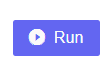
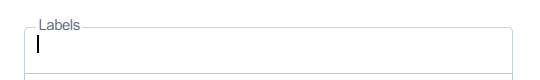
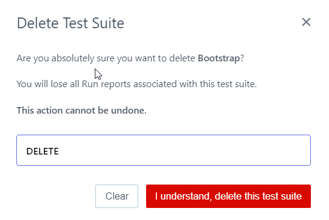
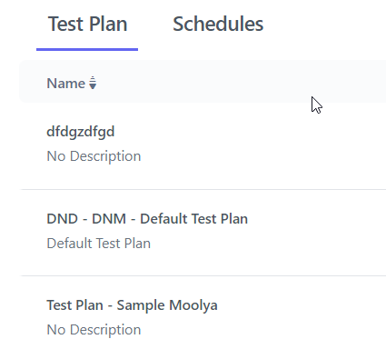
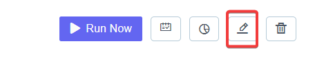
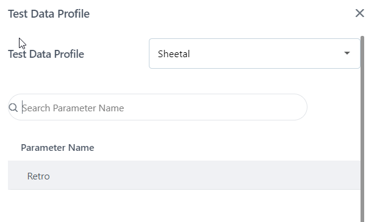

**Web Portal User Manual**

# Prerequisites:

Signup/Login to Portal URL: [https://accounts.contextqa.com](https://accounts.contextqa.com) 

Download Chrome Extension URL: <https://chrome.google.com/webstore/detail/contextqa-test-automation/pgadpooodaipbhbchnojijmlkhpamadh/related>

Default environment in Portal: **Dev-Test-Env-01**

# 
# 1. **How To Login to ContextQA Portal**
Video to be added

**Steps:**

1. Go to **Portal**
1. The Sign In page will be displayed.	

1. Enter **Organization**
1. Enter **Username**
1. Enter **Password** 
1. Click on **Submit**.
# **1.1  Sign Up/Register** 

1. Go to **ContextQA** **Portal** 
1. The below screen willl be displayed.	

1. Click on **Register.** 
1. Enter **Organisation Name**
1. Enter your **email id** and **Password.**
1. Click on **Submit**	

*Once you are through this process , you will receive an automated email detailed with your credentials as shown below*

# 2. **Test Case** 
` `A test case is a document, which has a set of test data, preconditions, expected results and postconditions, developed for a particular test scenario.

You can view the test cases under your current application by navigating to ***Design and development > Test cases*** from the ContextQA dashboard.

## **Add, edit, and delete test cases**

## To learn how to create a test case, lets begin here:

You can create Test Case from three different places whichever is quicker for you.

1. The standard way as mentioned in the following article.
1. When you login, on the right of the opening screen as shown

1. On the right side button of the page there is a button **Quick Start.** 

You can select any of the three methods to continue creating test cases.

## **2.1** **Create A Test Case** 
Here is the [Video](https://youtu.be/hJJa91jPoWo)

**Steps:** 

1. Go to **ContextQA Portal** 
1. On left hand side there will be a **Pencil Icon.**
1. Choose a **Test case** From the Design And Development List 
1. The **Test cases** list** will open as shown In the screenshot below 

1. On the right-hand side, There is a **Create** button as in the screenshot below
1. Click on **Create** button 

1. Enter the **Test Case** **Name** in the box as shown in the screenshot above 

1. On the right-hand side, there is a **Create** Button. Click on it. 
1. A message **“***Test Case Created Successfully***”** will be shown as the bottom left of the screen.	

## **2.2 Edit a Test Case** 

`      `**Steps**: 

1. Go to **ContextQA Portal.**
1. On the left hand side there is a **Pencil Icon.**
1. Choose a **Test case** from the Design And Development list and select a **Test Case** from the list of **Test Cases**.
1. On the right side, there is a **Pencil** Icon and click on it as shown.
1. **Edit Test Case** Screen is shown in Screenshot Above 

1. Edit **Name** and click on the **Update** button
1. Once the Test Case is edited, you will see a message at the bottom left- *Test case updated successfully*.

## **2.3 Search Test Case From the List** 
Here is the **[Video**](https://www.youtube.com/watch?v=BI-CSnPDujk&list=PLfRq0FuuqhRnYtoF6kHsDdZc7ekSgpg6V&index=3)**

**Steps**: 

1. Go to **ContextQA Portal** 
1. On the left-hand side there will be a **Pencil Icon.** Click on it 
1. Choose a **Test Case** from the Design And Development List.
1. The **Test Case** list will open as shown in the screenshot Below 

1. Among the panel options, you see there is** Search icon as shown in the screenshot below 

1. Click on Search** Icon. Search the desired Test case** from the list.

## **2.4**  **Delete Test Case** 
Here is the **[Video**](https://www.youtube.com/watch?v=tT5vb14OhkQ&list=PLfRq0FuuqhRnYtoF6kHsDdZc7ekSgpg6V&index=4)**

**Steps**: 

1. Go to **ContextQA Portal** 
1. On the left side there is the **Pencil Icon.** Click on it 
1. Choose a **Test case** From the Design And Development List 
1. The **Test cases** list** will open as shown in the screenshot below 

1. To **Delete** a test case, click on **Checkbox** And then click on the **Delete Button** as shown in the screenshot below.

1. A New **Pop-up** will open as shown

1. Click on **Yes Delete** Button 
1. A message will be shown *Selected Test Case Deleted Successfully.*

## **2.5 Run Test Case** 

**Steps**: 

1. Go to ContextQA **Portal** 
1. On the left-hand side, There Will Be a **Pencil Icon** Click on it 
1. Choose a **Test case** From the Design And Development List 
1. The **Test cases** list will open as shown below

1. Click on Given **Test Case**
1. **Test Steps** list will open
1. On the right-hand Side, There Is a **Run tab**

1. Click on **Run Tab,** and** it will **run** the test case .

## **2.5.1 Run Details** 
**Steps:** 

1. Go to **Portal** 
1. On the left-hand side, There Will Be a **Pencil Icon ( Test Development )** Click on it 
1. Choose a **Test case** from the Design And Development List 
1. The **Test cases** list will open as shown

1. Click on Given **Test Case**
1. **Test Steps** list will open.
1. On the right-hand Side, There is a **Run tab** 

1. Click on **Run History** from the below screen

1. Click on **Dry Run** under **Run History**

1. After Clicking on the **Dry Run,** it will show** 
1) **Run Details ,** 
1) **Test Steps (Executed)** 
1) **Test Step (Current)**

` `This screen below is displaying the **all the three tabs one adjacent to another**. 

After Clicking on the **Dry Run,** it will Open Run Details**.** Now, Click on **Test Steps (Executed).**

# 3. **Test Step**
Test Steps describe the execution steps and expected results that are documented against each one of those steps.

Each step is marked pass or fail based on the comparison result between the expected and actual outcome.

## **Add Steps to Test Case** 
Here is the Video **[https://www.youtube.com/watch?v=_K5uBf5vue8](http://video)**

**Steps**: 

1. Go to **ContextQA Portal** 
1. On the left side there will be a **Pencil Icon.**
1. Choose a **Test case** From the Design And Development List 
1. The Test cases list will open as shown in the screenshot below. 

1. Select your desired Test Case**				
1. **Test Steps** list screen will appear.
1. Add **Steps** as shown in the screen below

1. Click on **Create** Button 

## 3.1. **Add API Step**
Here is the **[Video](https://youtu.be/xwKriudEe1k)**

**Steps**: 

1. Go to **ContextQA Portal** 
1. On the left-hand side, there will be a **Test Development > Pencil Icon.**  Click on it 
1. Choose a **Test case** from the Design And Development list. 
1. The **Test cases** list will open as shown in the screenshot below.

1. Click on desired Test Case> Test Steps**.** Select **Rest API - REST\_API:  #{method}  -  #{title}**  from the list of templates.** 

1. Under Request Details enter all the details required to test the API.
1. Enter **Method**: GET, POST, PUT, PATCH, or DELETE
1. Enter endpoint **URL**
1. Enter **Header Name,** Enter **Header Value.**
1. Click on **Next**

1. Enter **Variable Name** (if you want to store response value in a variable)
1. Click on **Create** Button 

## **3.2 Add Steps in between two Test Steps** 
The video is to be updated  

**Steps**: 

1. Go to **ContextQA Portal** 
1. On the left side, there will be a **Pencil Icon**. Click on it 
1. Choose a **Test case** from the Design And Development List 
1. The **Test cases** list will open.

1. Click on desired **Test Case.**
1. **Test Steps** list will open and click on **Add Steps** as shown in the screenshot below

1. Select **Steps** and click on **Create** button 

## **3.3 Add If Condition** 

**Steps**: 

1. Go to **ContextQA Portal** 
1. On the left side, there will be **Pencil Icon.** Click on it 
1. Choose a **Test case** From the Design And Development List 
1. The **Test cases** list will open as shown in the screenshot below

1. Click on desired **Test Case** 
1. **Test Steps** list will open.
1. Click on the **option** of side panel as shown in the screenshot.

1. In this side panel Toggle we select the **If Conditional** option. By this, we will be adding the *If Condition* to the steps in our test case.

1. Add the conditions by choosing specific actions

1. Click on **Create** Button 

## **3.4 Add While Condition** 

**Steps:** 

1. Go to **ContextQA Portal** 
1. On the left side There Will Be a **Pencil Icon (Test Development)** Click on it 
1. Choose a **Test case** From the Design And Development List 
1. The **Test cases** list will open as shown in the screenshot below.
1. Click on given **Test Case. Test Steps** list will be displayed.
1. Click on the option of Side Panel as shown in the screenshot below

 

1. Select **While Loop** and this will add *While Condition* in the test step.

1. Add condition with *While Statement* by choosing specific action 

1. After Adding condition, click on **Create** Button 

## **3.5 Add For Loop** 

**Steps:** 

1. Go to **ContextQA Portal** 
1. On the left side There Will Be a **Pencil Icon.** Click on it 
1. Choose a **Test case** From the Design And Development List 
1. The **Test cases** list will be displayed as shown below

1. Click on desired **Test Case**
1. **Test Steps** list will be displayed. 
1. Click on the option of Side Panel as shown

1. Select **For Loop** option (For Data- Driven Testing only this option is used)

1. Enter **Test Data Profile, Loop Start, Loop End** 

1. Click on **Create** Button 

## **3.6 Add Element in Test Steps** 

**Steps:** 

1. Go to **ContextQA Portal** 
1. On the left side there will be a **Pencil Icon.** Click on it 
1. Choose a **Test case** from the Design and Development list
1. The **Test cases** list will open as shown in the screenshot below.

1. Click on desired **Test Case**
1. **Test Steps** list will open. 
1. Select ‘Click on **Label’,**  then Click on** the **Label** button as shown below. 

1. This will open element list on the right side as shown below

1. Select an **Element** From the list 
1. Click on the Create** button.

## **3.7 Reorder Test Steps** 

**Steps:** 

1. Go to **ContextQA Portal** 
1. On the left side, There Will Be a **Pencil Icon.** Click on it 
1. Choose a **Test case** From the Design And Development List 
1. The **Test cases** list will open as shown in the screenshot below

1. Click on desired **Test Case** 
1. There will be a **Reorder Tab** in the list of **Test Steps** 

1. To **Reorder** the Steps, click on the **Reorder** button. Drag and drop the steps in the order you want. 

1. Click on **Update**

# **4.0 Advance detail about test cases**
## **4.1**   **Add Parameter in Test Case**

**User has to Create Test Data Profile:** 

1. Navigate to **Test Development >Test data Profile**
1. Create a new **Test data Profile** with different columns

**Next Step:** 

1. Go to **ContextQA Portal** 
1. On the left hand **Pencil Icon (Test Development).** Click on it 
1. Choose a **Test Case** from the **Design And Development List** 
1. The **Test Case** list will open as shown In the screenshot below

1. Click on the desired **Test Case**
1. **Test Steps** list will open
1. In the **Test Case,** add a Test Step with **Test Data** as shown in the screenshot below.

1. Replace Test Data placeholder with **Parameter** from the Dropdown

1. Choose one of the Parameters that you just created 
1. Insert the parameter into the Test Case.

## 4.2 **Add Environment in Test Case**

**Steps:** 

1. Go to **Portal** 
1. On the Left Hand Side There Will Be A **Pencil Icon (Test Development)** Click on it 
1. Click on **Environment**
1. Click on **Create**

**Next Step:** 

1. Go to **Portal** 
1. On the Left Hand Side There Will Be A **Pencil Icon (Test Development)** Click on it 
1. Choose a **Test Case** From **Design And Development List** 
1. The **Test Case** List Will Open As Shown In the Screenshot Below 

1. Click on the given **Test Case**
1. **Test Steps** List Will Open.
1. In the **Test Case,** add a Test Step with **Test Data** as shown in the screenshot below.

1. Delete Test Data placeholder
1. Choose Environment from the Dropdown

1. Choose one of the Environments that you just created 
1. Insert the Environment into the Test Case.

## **4.3 Advance Options** 
Test case advanced options help you manage or group test cases better while creating test suites, test plans and understanding the test coverage.

To view the advanced options for you test case, click on Show advanced options on the Create test case page.

**Steps:** 

1. Go to **Portal** 
1. On the Left Hand Side There Will Be A **Pencil Icon (Test Development)** Click on it 
1. Choose a **Test Case** From **Design And Development List** 
1. The **Test Case** List Will Open As Shown In the Screenshot Below 

1. On the right-hand side click on **Create** button
1. Click on **Show Advance Options** 

The advanced options available are as follows:

1. **Adding Priority(Required):** Select the priority level that you want to set for this test case. 
   1. Critical – Highest priority
   1. Major – Test case for a major feature
   1. Medium – Medium priority
   1. Minor – Test case for a minor feature

**Type (Required)**: Select any of the below test method type that needs to be gratified using this test case. 

1. Unit test
1. Integration
1. Functional
1. Non-functional
1. User Experience

.**Status (Required)**: Test case status is used for organizing and managing the testing workflow. Select the appropriate status from the given options :**Draft, In Review, Ready, Obsolete, Rework**  as shown in the screenshot below

Select the appropriate status for the Test Case.
Note: Only Test Cases in ready state will be available for execution.

1. Draft – Test case is in an abstract mode.
1. Review- Test Case is under inspection.
1. Ready- Test Case is active and ready to be executed.
1. Obsolete- Test Case is no longer valid.
1. Rework – Test Case needs to be updated.

**Prerequisite (Required)**: Select another Test Case as a prerequisite for this Test Case. This will help you save execution time when a prerequisite condition is not met.

For example, in the case of an e-commerce shopping website, the test case Add Items to Cart would be a prerequisite for Place Order since an order cannot be placed in an empty Cart. If the Add Items to Cart Test Case is not added to the Test Suite, the Test will fail in most cases. Therefore, it would be beneficial to add it as a prerequisite for the Place Order Test Case.

1. **Labels**: You can assign existing tags to the test cases or create new tags.

1. **Test Data Profile:** Select the Test Data profile to be used in the Test Case. This is required only if you are going to use parameter type test data in your test steps. 

1. **Data-Driven (toggle)**: Enable this if you want to run the same test case repeatedly, each time with a different set of data for the input fields. You will need to add a Test Data Profile before enabling this option as shown.

1. Enter  **Data Iterates from, Data Iterates Till** 
1. Edit **Description**

5\.0 **Test Suite** 
#
## 5.1 **Create Test Suite** 
[Video](https://www.youtube.com/watch?v=yqQufISzvGw&list=PLfRq0FuuqhRnYtoF6kHsDdZc7ekSgpg6V&index=9)

Steps: 

1. Go to **Portal** 
1. On the Left Hand Side There Will Be A **Pencil Icon (Test Development)** Click on it 
1. Choose **Test Suite** From **Test Plan & Result in** 
1. The **Test Suite** List Will open As Shown in the Screenshot Below 

1. On Right Hand Side, There Is **Create** Button 
1. Click on **Create Button**
1. Enter **Name, Prerequisite, Add Test Cases, Add Labels** As Shown in Screenshot Below 
1. 
1. Click on **Create Button** 

## 5.2 Edit Test Suite 
[**Video**](https://www.youtube.com/watch?v=CcYkOUTBQPg&list=PLfRq0FuuqhRnYtoF6kHsDdZc7ekSgpg6V&index=10)

Steps: 

1. Go to **Portal** 
1. On the Left Hand Side There Will Be A **Pencil Icon ( Test Development )**Click on it 
1. Choose **Test Suite** From **Test Plan & Result** 
1. Click On Given **Test Suite** 
1. **Test cases** List Will Open As Shown In the Screenshot Below 
1. 
1. On the Right Hand Side, There Is a Pencil **Icon.** Click on it.
1. **Edit Test Suite** Screen Open As Shown in the Screenshot Above.
1. 
1. Edit **Name, Prerequisite, Add Test cases, Add Labels** 
1. Click on **Update Tab** 

## 5.3 **Delete Test Suite** 
[Video ](https://www.youtube.com/watch?v=Rc5LYfrWV9Y&list=PLfRq0FuuqhRnYtoF6kHsDdZc7ekSgpg6V&index=13)

Steps: 

Go to **Portal** 

On the Left Hand Side There Will Be A **Pencil Icon (Test Development)** Click on it 

Choose **Test Suite** From **Test Plan & Result**  

Click On Given **Test Suite** 

**The test cases** List Will Open As Shown In the Screenshot Below 

On the right-hand Side There Is an Option For a **Delete icon**
**
` `Click on it **Delete Icon** 

A New Pop-up Open enters **Delete,** And Clicks on **I Understand, Delete this Test Suite** As Shown in the Screenshot Above 

# 6.0 **Test Plan** 
#
## 6.1  **Create Test Plan** 

Steps: 

1. Go to **Portal** 
1. On the left-hand side There Will Be A **Pencil Icon (Test Development)** Click on it 
1. Choose the **Test Plan** From **Test Plan & Result** 
1. The **Test Plan** List Will Open As Shown In the Screenshot Below

1. On the right-hand Side There Is A Button of **+Test Plan** 
1. Click on it 
1. Enter **Test Plan Name, Description, and Labels** 

1. Click on **Next Button** 
1. Select **Test Suite** 
1. 
1. Click on **Add Machine Device** 

1. Edit **Name, Select OS, OS Version, Select Browser, Browser Version And Resolution.**
1. Click on **Create Button** 

## ** 

**Steps**: 

1. Go to **ContextQA** **Portal** 
1. On the left-hand side There Will Be A **Pencil Icon.** Click on it 
1. Choose the **Test plan** from **Test Plan & Result** 
1. The **Test plan** List Will Open As Shown In the Screenshot Below

1. Select Given **Test Plan** 
1. On the right-hand Side There Is an **Edit** Tab Click on it 
1. 
1. Click on it 
1. Edit **Test Plan Name, Description, Labels** 

1. Click on **Next Button** 
1. Select **Test Suite** 

1. Click on **Add Machine Device** 

1. Edit **Name, Select OS, OS Version, Select Browser, Browser Version And Resolution.**
1. Click on **Create Button** 

## 6.4 **Add Cross Browser Test Plan** 

[**Video** ](https://www.youtube.com/watch?v=Fv17eJkZucw&list=PLfRq0FuuqhRnYtoF6kHsDdZc7ekSgpg6V&index=15)

**Steps:** 

1. Go to **Portal** 
1. On the left-hand side There Will Be A **Pencil Icon (Test Development)** Click on it 
1. Choose the **Test Plan** From **Test Plan & Result** 
1. The **Test Plan** List Will Open As Shown In the Screenshot Below.
1. 
1. On the right-hand Side There Is A Button for **+Test Plan** 
1. Click on it 
1. Enter **Test Plan Name, Description, and Labels** 
1. 
1. Click on **Next Button** 
1. Select **Test Suite** 
1. 
1. Click on **Add Machine Device** 
1. 
1. Edit **Name** 
1. ` `**Select OS, OS Version, Select Browser, Browser Version, And Resolution.**
1. Click on **Create Button** 

## 6.5 **Add Cross Device Test Plan** 
##
[Video](https://youtu.be/gFoUQfguwvM)

**Steps:** 

1. Go to **Portal** 
1. On the left-hand side There Will Be A **Pencil Icon (Test Development)** Click on it 
1. Choose the **Test Plan** From **Test Plan & Result** 
1. The **Test Plan** List Will Open As Shown In the Screenshot Below.
1. 
1. On the right-hand Side There Is A Button of **+Test Plan** 
1. Click on it 
1. Enter **Test Plan Name, Description, and Labels** 
1. 
1. Click on **Next Button** 
1. Select **Test Suite** 
1. 
1. Click on **Add Machine Device** 
1. 
1. Edit **Name** 
1. ` `**Select OS, OS Version, Select Browser, Browser Version, And Resolution.**
1. Click on **Create Button** 

## 6.6 **Add Cross Platform Test Plan** 
##
[Video](https://youtu.be/L5QzmwjtWxc)

**Steps:** 

1. Go to **Portal** 
1. On the left-hand side There Will Be A **Pencil Icon (Test Development)** Click on it 
1. Choose the **Test Plan** From **Test Plan & Result** 
1. The **Test Plan** List Will Open As Shown In the Screenshot Below.
1. 
1. On the right-hand Side There Is A Button of **+Test Plan** 
1. Click on it 
1. Enter **Test Plan Name, Description, and Labels** 
1. 
1. Click on **Next Button** 
1. Select **Test Suite** 
1. 
1. Click on **Add Machine Device** 
1. 
1. Edit **Name** 
1. ` `**Select OS, OS Version, Select Browser, Browser Version, And Resolution.**
1. Click on **Create Button** 

## 6.7 **Delete Test Plan** 

**Steps:** 

1. Go to **Portal** 
1. On the left-hand Side There Will Be A **Pencil Icon (Test Development)** Click on it 
1. Choose the **Test Plan** From **Test Plan & Result** 
1. The **Test Plan** List Will Open As Shown In the Screenshot Below.
1. 
1. Select Given **Test Plan** 
1. Click on **Delete Button** 
1. 
1. Enter **Delete** 
1. Click on **I understand, Delete this Test plan** 

## 7. **Run Result** 

## 7.1 **Find Last Run Result** 

Steps: 

1. Go to **Portal** 
1. On the left-hand side There Will Be A **Pencil Icon (Test Development)** Click on it 
1. Choose **Run Result** From **Test Plan & Result** 
1. 
1. Select Given **Run Result** 
1. 
1. Move the Mouse Cursor Up until the end, You Will find the last Run Result in the End.

## 7.2 **Find run result details** 

**Steps:** 

1. ** Go to **Portal** 
1. On the left-hand side There Will Be A **Pencil Icon (Test Development)** Click on it 
1. Choose **Run Result** From **Test Plan & Result** 
1. 
1. Select Given **Run Result** 
1. 
1. Click on **Run Result** 
1. On the right-hand Side There Is A option for  **More Details** 
1. 
1. Click on **More Details** 
1. A Pop-up Opens 
1. 

## 7.2.1 **Overall Pass/Fail Status** 
##
**Steps:** 

1. ** Go to **Portal** 
1. On the left-hand side There Will Be A **Pencil Icon (Test Development)** Click on it 
1. Choose **Run Result** From **Test Plan & Result** 
1. 
1. Select Given **Run Result** 
1. 
1. Click on **Given Test Case** 
1. On the right-hand Side There Is A option for  **More Details** 
1. 
1. Click on **More Details** 
1. A Pop-up Opens 
1. 

## 7.2.2 **Total Test Steps Passed** 

**Steps:** 
1. **
   ` `Go to **Portal** 
1. On the left-hand side There Will Be A **Pencil Icon (Test Development)** Click on it 
1. Choose **Run Result** From **Test Plan & Result** 
1. 
1. Select Given **Run Result** 
1. 
1. Click on **Given Test Case** 
1. On the right-hand Side There Is A option of  **More Details** 
1. 
1. Click on **More Details** 
1. A Pop-up Opens 
1. 

## 7.2.3 **Total Test Step Failed** 

**Steps:** 

1. ** Go to **Portal** 
1. On the left-hand side There Will Be A **Pencil Icon (Test Development)** Click on it 
1. Choose **Run Result** From **Test Plan & Result** 
1. 
1. Select Given **Run Result** 
1. 
1. Click on **Given Test Case** 
1. On the right-hand Side There Is A option for  **More Details** 
1. 
1. Click on **More Details** 
1. A Pop-up Opens 
1. 

## 7.3 **Find Execution Recording** 
##
**Steps:** 

1. Go to **Portal** 
1. On the left-hand Side There Will Be A **Pencil Icon (Test Development)** Click on it 
1. Choose **Run Result** From **Test Plan & Result** 
1. 
1. Select Given **Run Result** 
1. 
1. Right Click on **Recording Option,** and Select **Open link in new Tab** 

## 7.4 **Find Execution Trace** 

**Steps:**  

1. Go to **Portal** 
1. On the left-hand side There Will Be A **Pencil Icon (Test Development)** Click on it 
1. Choose **Run Result** From **Test Plan & Result** 
1. 
1. Select Given **Run Result** 

1. Right Click on **Trace Option,** and Select **Open link in new Tab** 

# **Data-Driven Testing** 
Data-driven testing (DDT) is data that is external to your functional tests and is loaded and used to extend your automated test cases. You can take the same test case and run it with as many different inputs as you like, thus getting better coverage from a single test.

In the simplest form, the tester supplies the inputs from a row in the table and expects the outputs which occur in the same row.
# 8. **Data Profile** 
** 
## 8.1 **Create Test Data Profile** 
## [Create Test Data Profile | Portal | ContextQA](https://www.youtube.com/watch?v=ZTmJeMoPz4g&list=PLfRq0FuuqhRnYtoF6kHsDdZc7ekSgpg6V&index=8)
**Steps:** 

1. Go to **Portal** 
1. On the left-hand side, There Will Be A **Pencil Icon (Test Development).** Click on it.
1. Choose **Test data Profile** From the **Design And Development List** 
1. The **Test data Profile** List Will Open As Shown In the Screenshot Below

1. On the right-hand side There is **Create** button
1. Click On **Create** button**.**

1. Enter the **Name** For the Test Data Profile 
1. Enter **Set Name** as shown in the Screenshot Below.

1. On the right-hand Side There Is **Create Button** Click on it 
1. **Test Data Profile Created** Successfully Message Will Appear 

## 8.2 **Update Test Data Profile** 

**Steps:** 

1. Go to **Portal** 
1. On the left-hand side There Will Be A **Pencil Icon (Test Development)** Click on it 
1. Choose **Test data Profile** From the **Design And Development List** 
1. The **Test data Profile** List Will Open As Shown In the Screenshot Below
1. 
1. Click on Given **Test Data Profile** 
1. On the right-hand Side, There Is a Pencil Icon **( Edit )** 
1. Click on the **Edit Button** 
1. Enter the **Name** For the Test Data Profile 
1. Enter **Set Name**  as shown in the Screenshot Below 
1. 
1. On the right-hand Side There Is **Create Button** Click on it 
1. **Test Data Profile Created** Successfully Message Will Appear 

## 8.2.1 **Add Row** 

**Steps:** 

1. Go to **Portal** 
1. On the left-hand side There Will Be A **Pencil Icon (Test Development)** Click on it 
1. Choose **Test data Profile** From the **Design And Development List** 
1. The **Test data Profile** List Will Open As Shown In the Screenshot Below
1. 
1. Click on Given **Test Data Profile** 
1. On the right-hand Side, There Is a Pencil Icon **( Edit )** 
1. Click on **Edit Button** 
1. On the left-hand Side There Is a **+icon** 
1. 
1. Click on +icon, This will **Add New Row** 
## 8.2.2 **Add Column** 

**Steps:** 

1. Go to **Portal** 
1. On the left-hand side There Will Be A **Pencil Icon (Test Development)** Click on it 
1. Choose **Test data Profile** From **Design And Development List** 
1. The **Test data Profile**  List Will Open As Shown In the Screenshot Below
1. 
1. Click on Given **Test Data Profile** 
1. On the right-hand Side, There Is a Pencil Icon **( Edit )** 
1. Click on **Edit Button** 
1. 
1. On the right-hand Side There Is a **+icon** 
1. 
1. Click on +icon, This will **Add New Column** 

## 8.3 **Use the data profile with test step** 
## [Create Test Data Profile | Portal | ContextQA](https://www.youtube.com/watch?v=ZTmJeMoPz4g&list=PLfRq0FuuqhRnYtoF6kHsDdZc7ekSgpg6V&index=8)
**Steps:** 

1. Go to **Portal** 
1. On the left-hand Side There Will Be A **Pencil Icon (Test Development)** Click on it 
1. Choose **Test data Profile** From **Design And Development List** 
1. The **Test data Profile** List Will Open As Shown In the Screenshot Below
1. 
1. On the right-hand Side There is **Create Button**
1. Click On **Create Button** 

1. 
1. Enter the **Name** For the Test Data Profile 
1. Enter **Set Name**  as shown in the Screenshot Below 
1. 
1. On the right-hand Side There Is **Create Button** Click on it 
1. **Test Data Profile Created** Successfully Message Will Appear 
1. Create New **Test Case** Or Edit an Existing Test Case
1. Click on **Show** **Advanced Options** 
1. 
1. Click on **Test Data Profile in Advanced Options**
1. Select  **Test Data Profile** from **Dropdown**
1. Click on **Create Button** 
1. In the list of Steps 
1. Enter **Test-Data** in the **Elements** Field
1. Delete **the test data** placeholder from the above line and Choose **Parameter** from the Drop-down
1. 
1. A new Pop-up opens **Add Parameter**  
1. 
1. Click on **Create** Button 

## 8.4 **Delete Test Data Profile** 

[Video](https://www.youtube.com/watch?v=ZTmJeMoPz4g&list=PLfRq0FuuqhRnYtoF6kHsDdZc7ekSgpg6V&index=8)

**Steps:** 

1. Go to **Portal** 
1. On the left-hand Side There Will Be A **Pencil Icon (Test Development)** Click on it 
1. Choose **Test data Profile** From **Design And Development List** 
1. The **Test data Profile** List Will Open As Shown In the Screenshot Below
1. 
1. You Can **Delete** The Given Test Data 
1. On the right-hand Side There will Be A **Delete Icon** 
1. 
1. Click on Delete Icon 

1. Enter **Delete** and Click on **I Understand, delete this test data**

# 9. **Environments** 
You must use different test data depending on the environment when you have multiple testing environments. For example, if your test is executing in both staging and QA environments, you can use two separate test data sets for both environments.

## 9.1. **Create Environment** 
[**Video**](https://www.youtube.com/watch?v=DQptv3CPFCc&list=PLfRq0FuuqhRnYtoF6kHsDdZc7ekSgpg6V&index=6)

[Create Environment | Portal | ContextQA](https://www.youtube.com/watch?v=DQptv3CPFCc&list=PLfRq0FuuqhRnYtoF6kHsDdZc7ekSgpg6V&index=6)

**Steps:** 

1. Go to **Portal**
1. On the left-hand Side There Will Be A **Pencil Icon (Test Development)** Click on it 
1. Choose **Environments** From **Test Plan & Result**  As shown in Screenshot Below 

1. Click on **Create**

Here, you create an environment and add the parameter names and values that will be specific to this environment. Below are the fields you see on this form:

1. ***Name***: Name of the environment
1. ***Description***: Description for your environment
1. ***Parameter Name, Parameter Value:*** Here you mention the name of a parameter specific to this environment and its corresponding value. When you enter the values for one key-value pair, the text fields for adding another will automatically appear. As a result, you can add as many key-value pairs as you need. You can add these values to the JSON format; you need to select the tab labelled JSON Format.
1. **Enter Name, Description, Parameter Name, and Parameter value.**
1. Click **on Create Button** 
**

## 9.2. **Edit Environment** 
[**Video**](https://www.youtube.com/watch?v=jLo9UAF1oPs&list=PLfRq0FuuqhRnYtoF6kHsDdZc7ekSgpg6V&index=7)

**Steps:** 

1. Go to **Portal** 
1. On the left-hand side, There Will Be A **Pencil Icon (Test Development)** Click on it 
1. Choose **Environments** From **Test Plan & Result**
1. Select **Environments** From the List 

1. On the right-hand Side There Is **Edit Tab (Pencil icon), Click on it** 
1. **Edit Name, Description, Parameter Name, Parameter value.**
1. Click **on Update Button** 

## 9.3 **Delete Environment** 

**Steps:** 

1. Go to **Portal** 
1. On the left-hand side, There Will Be A **Pencil Icon (Test Development)** Click on it 
1. Choose **Environments** From **Test Plan & Result**

1. **
   ` `You Can **Delete** Given **Environment**  
1. On the right-hand side There will Be A **Delete Icon**

1. Click on **Delete Icon** 

1. Click on **Yes, Delete**

# 10. **Elements**
# Elements Repository is a shared list that contains all the elements created in a specific Application Version. All the Test Cases within the Application Version can use these elements in their Test Steps. 
##  10.1  **Create Element** 

**Steps:** 

1. Go to **Portal** 
1. On the left-hand side There Will Be A **Pencil Icon (Test Development)** Click on it 
1. Choose **Elements** From **Design and Development** 

1. On the right-hand side, there is a **Create Button** 
1. Click on **Create Button** 

1. Enter **Name, Screen name, Locator type, Enter Value**
1. Click on **Create Button** 

## 10.2 **Edit Element** 

**Steps:** 

1. Go to **Portal** 
1. On the left-hand side There Will Be A **Pencil Icon (Test Development)** Click on it 
1. Choose **Element** From **Design and Development**

1. You can **Edit** the given **Element**
1. On the right-hand side, there is a **Pencil icon ( Edit )** 
1. Click on it 

1. Edit  **Name, Screen name, Locator type, Enter Value**
1. Click on **Create Button** 

## 10.4 **Delete Element** 

**Steps:** 

1. Go to **Portal** 
1. On the Left Hand Side There Will Be A **Pencil Icon (Test Development)** Click on it 
1. Choose **Elements** From **Design and Development**

1. You can **Delete** the given **Elements** 
1. On the right-hand side there is a **Delete icon**

1. Click on it 

1. Click on **Yes, Delete**  

# 11. **Others** 
## 11.1 **Test Case Priority** 
**Steps:** 

1. Go to **Portal**
1. On the Left Hand Side, there is an Option for **Workspace Settings** 
1. Click on **Workspace Setting** And Choose **Test Case Priorities** 

1. On Right Hand Side there is a **+Add Priority Button** 
1. Click on it 
1. Enter new priority and Press **Enter** to save
# 12. **PORTAL ( JIRA )** 

## 12.1 **Create JIRA Ticket from Portal** 

**Steps :** 

1. Go to **Portal** 
1. On the left-hand side There Will Be A **Pencil Icon (Test Development)** Click on it 
1. Choose **Run Result** From **Test Plan & Result** 

1. Select Given **Run Result** 

1. Click on Test Case in Run Result 
1. On the Right hand side, there is a Bug Button.

1. Click on it.

1. Add Summary, Description and Click on Save Button. 

