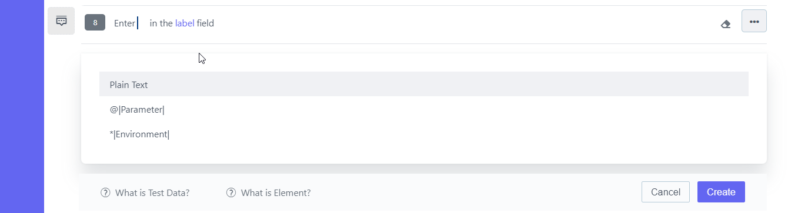

## 8.3 **Use the data profile with test step** 
## [Create Test Data Profile | Portal | ContextQA](https://www.youtube.com/watch?v=ZTmJeMoPz4g&list=PLfRq0FuuqhRnYtoF6kHsDdZc7ekSgpg6V&index=8)
**Steps:** 

1. Go to **Portal** 
2. On the left-hand Side There Will Be A **Pencil Icon (Test Development)** Click on it 
3. Choose **Test data Profile** From **Design And Development List** 
4. The **Test data Profile** List Will Open As Shown In the Screenshot Below
5. 
6. On the right-hand Side There is **Create Button**
7. Click On **Create Button** 
8. 
9. Enter the **Name** For the Test Data Profile 
10. Enter **Set Name**  as shown in the Screenshot Below 
11. 
12. On the right-hand Side There Is **Create Button** Click on it 
13. **Test Data Profile Created** Successfully Message Will Appear 
14. Create New **Test Case** Or Edit an Existing Test Case
15. Click on **Show** **Advanced Options** 
16. 
17. Click on **Test Data Profile in Advanced Options**
18. Select  **Test Data Profile** from **Dropdown**
19. Click on **Create Button** 
20. In the list of Steps 
21. Enter **Test-Data** in the **Elements** Field
22. Delete **the test data** placeholder from the above line and Choose **Parameter** from the Drop-down
22. 
23. A new Pop-up opens **Add Parameter**  
24. 
25. Click on **Create** Button 