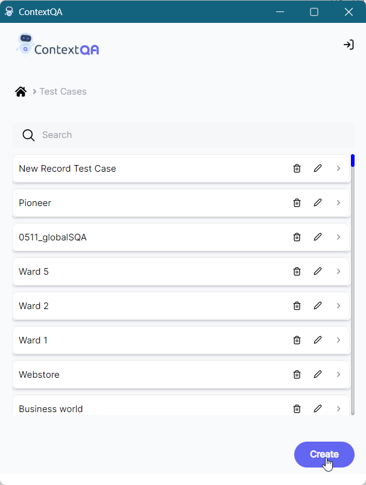
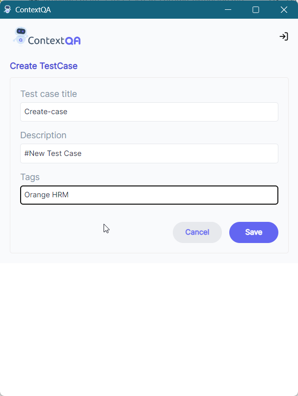

## **2. Create a Test Case in Chrome Extension**  
How to create- [**Video**](https://www.youtube.com/watch?v=01eY1n4bZUA&list=PLfRq0FuuqhRkB4nAD6NYbmzSYoi0yA8OG&index=2)

1. Click on **Extension icon.** 
2. **Test Cases** can be created from both - **Test Case List and Test Suite List** 
3. Click on **Test Case List.** 
4. There is a **Create** button as shown in the screenshot below 

5. Click on **Create** button 
6. Add **Test Case Title, Description, and Tags**.

7. Click on **Save.**

