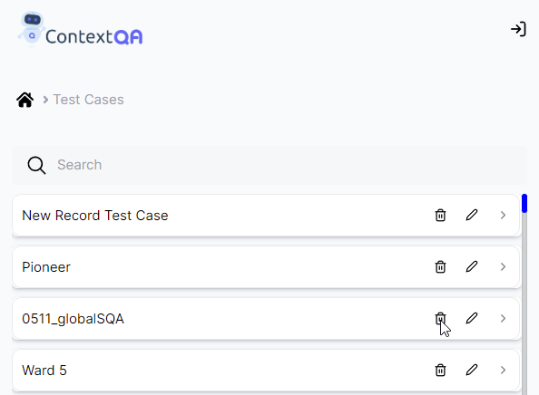

## **4. Delete Test Case in Extension** 
[**Video** ](https://www.youtube.com/watch?v=6ihdpNnEuT8&list=PLfRq0FuuqhRkB4nAD6NYbmzSYoi0yA8OG&index=11)

**Steps**

1. Click on **Extension icon.**  
2. Go to **Test Case List**
3. Test case list** will open.
4. Search for the respective **Test Case**.
5. Click on **Delete Icon** as shown in the screenshot below

