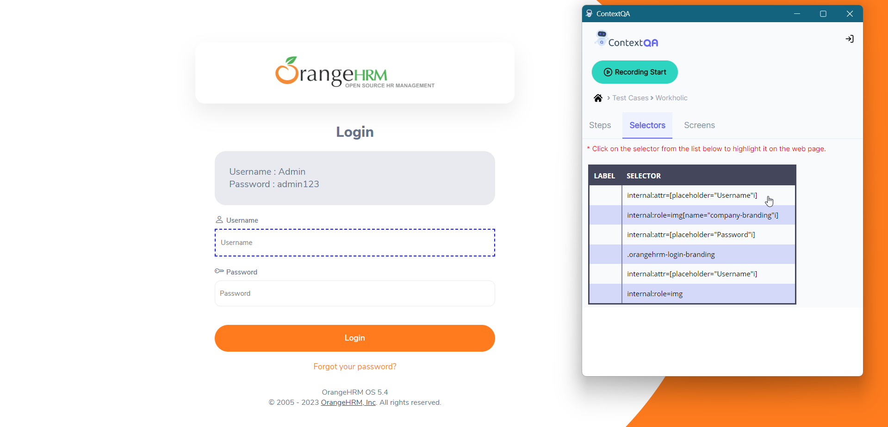

## 10. **Highlighter Feature**

[Video](https://www.youtube.com/watch?v=N9I_dhvI7Xk&list=PLfRq0FuuqhRkB4nAD6NYbmzSYoi0yA8OG&index=17)

1. Go to **Extension** 
2. Create a new **Test Case**
3. Click on **Test Case** 
4. Click on the **record** button 
5. Click on the **finish** button after recording 
6. Go to created **Test case** 
7. In **Test Steps**, there is a selector button. If we click on the selector button it will select the option we recorded in Extension. 

