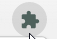
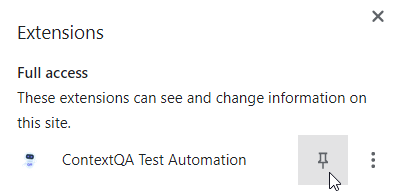
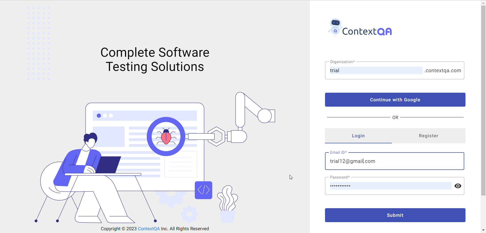

## **1.0 Login Chrome Extension** 

**Steps** : 

1. Go to Extension 
2. Pin the ContextQA icon 

3. Click on the **ContextQA** icon **Login** screen will open.

4. Click on **Login**  button, it will redirect the user to <https://accounts.contextqa.com>

5. Enter Your **Organisation.**
6. Enter your **Username & Password** 
7. Click on **Login.** 

**Case II**

**For Signin Up kindly refer to ContextQA Portal Documentation.**

<https://docs.google.com/document/d/1Fe9R_lDLDq6RCeugUXrxTSkvSrt8_ibCXzTZvJJeNRU/edit#heading=h.42hfbyysqogf>