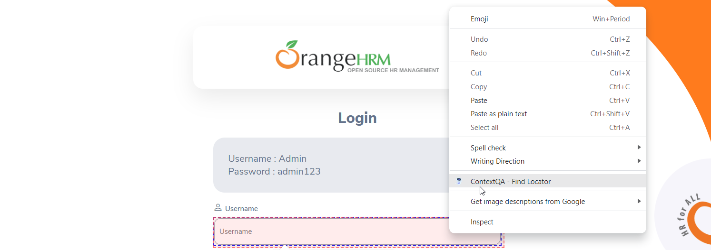

**12.0 Selector** 

1. Go to **Extension** 
2. Click on **Selector** 
3. Now, Click on **Locator Start** Button.
4. To take an Element using a Selector, Right click on the Element and select the **ContextQA Find Locator** to get the Elements.

