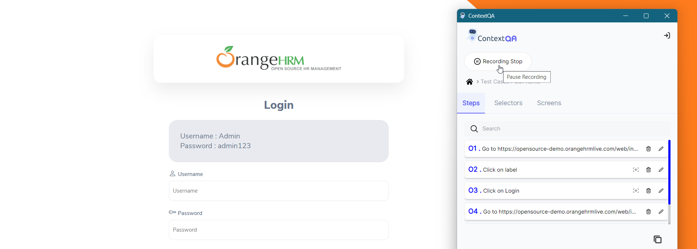

## 5. **Start and Stop recording in Extension** 
[**Video**](https://www.youtube.com/watch?v=vJPo1xnzNOw&list=PLfRq0FuuqhRkB4nAD6NYbmzSYoi0yA8OG&index=4)

1. Click on **Extension icon.** 
2. Click on **Test Case List**
3. The test case** list will open.
4. Click on your **Test Case.** 
5. Click on the **Recording Start** button as shown in the screenshot.

6. Once done, click on the **Recording Stop** Button.

