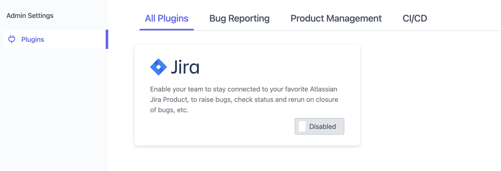
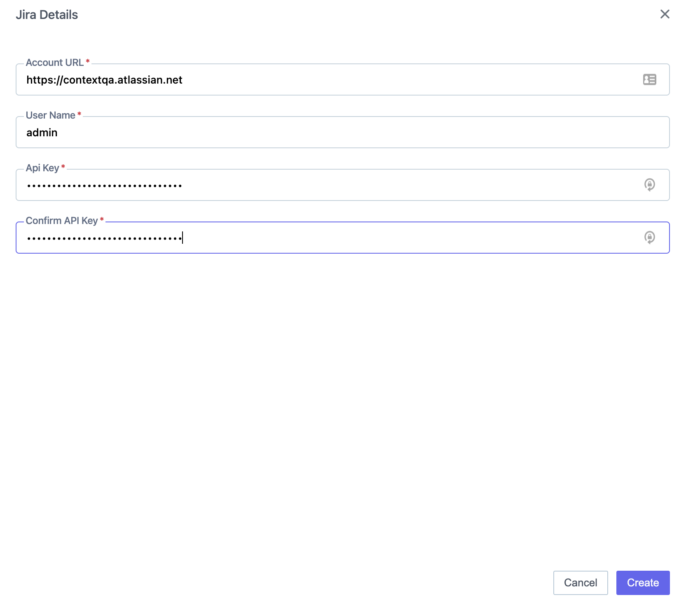

## Login to ContextQA Portal

**Steps:**

**Steps:**

1.  After logging in, click on the "Settings" tab from the left panel.
    
2.  Scroll down and find the Jira plugin section.

    
3.  Enable the Jira plugin by clicking on the "Disabled" button. A configuration modal will open.

    
4.  Fill in the required information in the opened modal:
    
    -   Account URL: Enter your Jira Account URL, for example, [https://contextqa.atlassian.net/](https://contextqa.atlassian.net/)
    -   User Name: Enter your Jira Username or Email Id
    -   API Key: Enter your Jira API Token. If you don’t have a token, you can create one at [https://id.atlassian.com/manage-profile/security/api-tokens](https://id.atlassian.com/manage-profile/security/api-tokens)

5.  Click on "Create" to complete your Jira Integration.