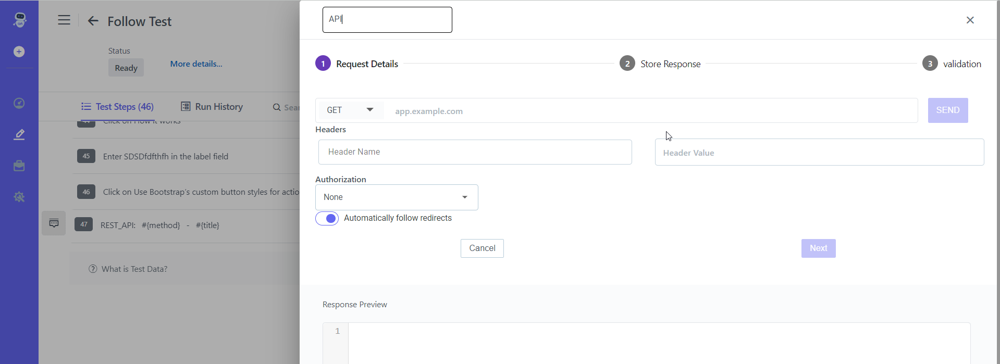

##  Add API Step
Here is the **[Video](https://youtu.be/xwKriudEe1k)**

**Steps**: 

1. Go to **ContextQA Portal** 
2. On the left-hand side, there will be a **Test Development > Pencil Icon.**  Click on it 
3. Choose a **Test case** from the Design And Development list. 
4. The **Test cases** list will open as shown in the screenshot below.

5. Click on desired Test Case> Test Steps Select **Rest API - REST\_API:  #{method}  -  #{title}**  from the list of templates. 

6. Under Request Details enter all the details required to test the API.
7. Enter **Method**: GET, POST, PUT, PATCH, or DELETE
8. Enter endpoint **URL**
9. Enter **Header Name,** Enter **Header Value.**
10. Click on **Next**

11. Enter **Variable Name** (if you want to store response value in a variable)
12. Click on **Create** Button 

