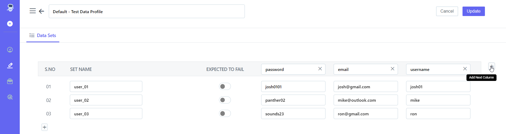

## 8.2.2 **Add Column**  

**Steps:** 

1. Go to **Portal** 
1. On the left-hand side There Will Be A **Pencil Icon (Test Development)** Click on it 
1. Choose **Test data Profile** From **Design And Development List** 
1. The **Test data Profile**  List Will Open As Shown In the Screenshot Below
1. 
1. Click on Given **Test Data Profile** 
1. On the right-hand Side, There Is a Pencil Icon **( Edit )** 
1. Click on **Edit Button** 
1. On the right-hand Side There Is a **+icon** 
1. 
1. Click on +icon, This will **Add New Column** 
