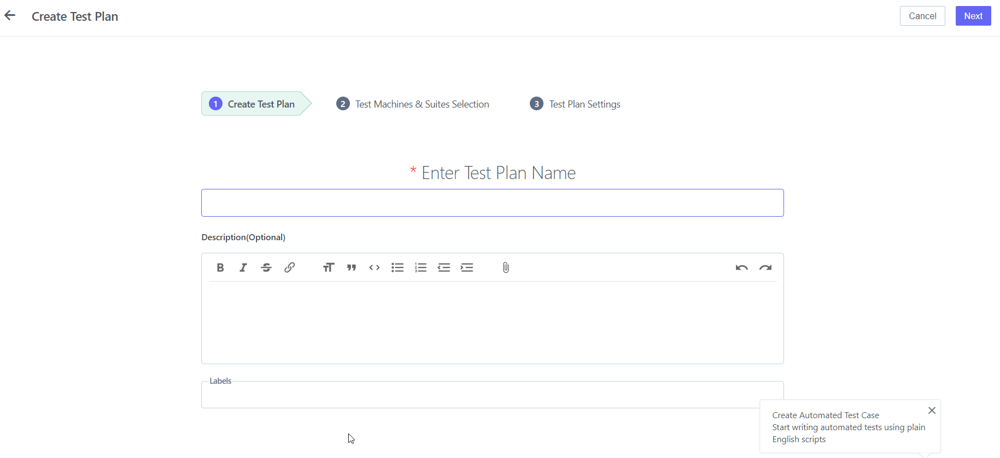
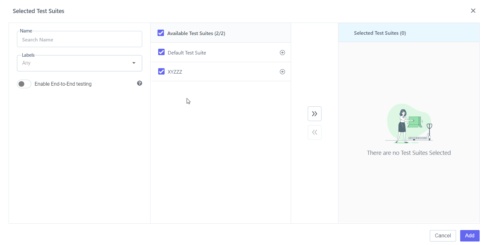
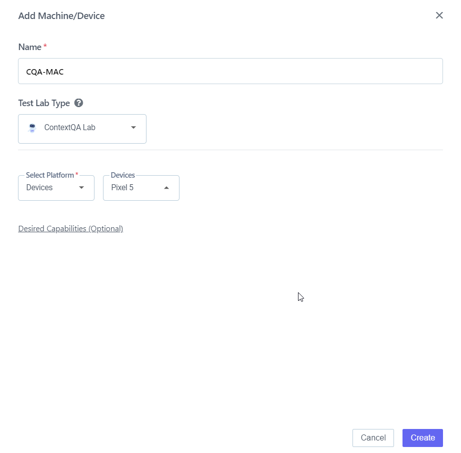

## 6.4 **Add Cross Browser Test Plan** 

[**Video** ](https://www.youtube.com/watch?v=Fv17eJkZucw&list=PLfRq0FuuqhRnYtoF6kHsDdZc7ekSgpg6V&index=15)

**Steps:** 

1. Go to **Portal** 
2. On the left-hand side There Will Be A **Pencil Icon (Test Development)** Click on it 
3. Choose the **Test Plan** From **Test Plan & Result** 
4. The **Test Plan** List Will Open As Shown In the Screenshot Below.
5. 
6. On the right-hand Side There Is A Button for **+Test Plan** 
7. Click on it 
8. Enter **Test Plan Name, Description, and Labels** 
9. 
10. Click on **Next Button** 
11. Select **Test Suite** 
12. 
13. Click on **Add Machine Device** 
14. 
15. Edit **Name** 
16. ` `**Select OS, OS Version, Select Browser, Browser Version, And Resolution.**
17. Click on **Create Button** 
