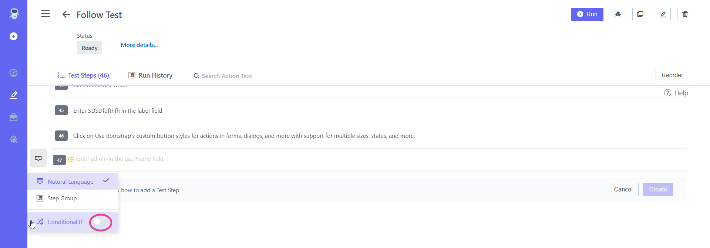
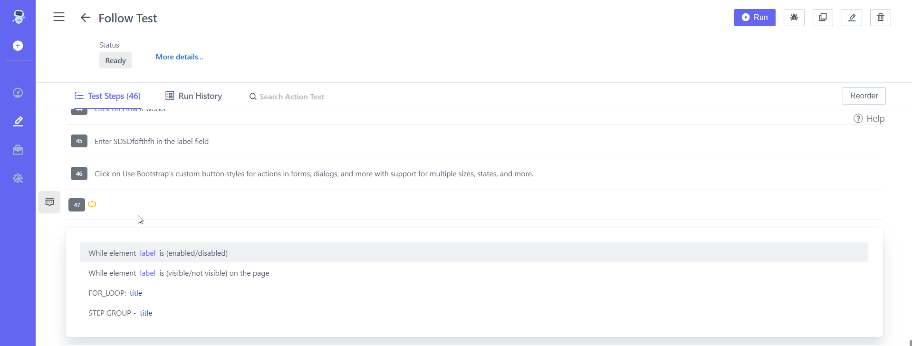

## **3.4 Add While Condition** 

**Steps:** 

1. Go to **ContextQA Portal** 
1. On the left side There Will Be a **Pencil Icon (Test Development)** Click on it 
1. Choose a **Test case** From the Design And Development List 
1. The **Test cases** list will open as shown in the screenshot below.
 
1. Click on given **Test Case. Test Steps** list will be displayed.
1. Click on the option of Side Panel as shown in the screenshot below

 

1. Select **While Loop** and this will add *While Condition* in the test step.

1. Add condition with **While Statement** by choosing specific action 

1. After Adding condition, click on **Create** Button 
