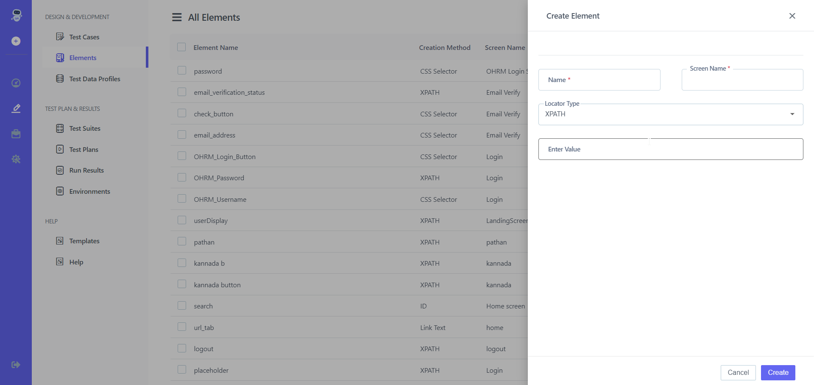

# 10. **Elements**
# Elements Repository is a shared list that contains all the elements created in a specific Application Version. All the Test Cases within the Application Version can use these elements in their Test Steps. 
##  10.1  **Create Element** 

**Steps:** 

1. Go to **Portal** 
2. On the left-hand side There Will Be A **Pencil Icon (Test Development)** Click on it 
3. Choose **Elements** From **Design and Development** 

4. On the right-hand side, there is a **Create Button** 
5. Click on **Create Button** 

6. Enter **Name, Screen name, Locator type, Enter Value**
7. Click on **Create Button** 

