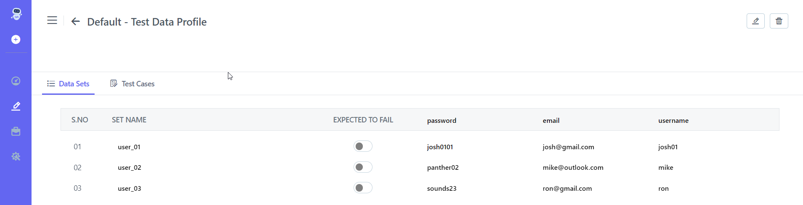

## 8.1 **Create Test Data Profile** 
## [Create Test Data Profile | Portal | ContextQA](https://www.youtube.com/watch?v=ZTmJeMoPz4g&list=PLfRq0FuuqhRnYtoF6kHsDdZc7ekSgpg6V&index=8)
**Steps:** 

1. Go to **Portal** 
2. On the left-hand side, There Will Be A **Pencil Icon (Test Development).** Click on it.
3. Choose **Test data Profile** From the **Design And Development List** 
4. The **Test data Profile** List Will Open As Shown In the Screenshot Below

5. On the right-hand side There is **Create** button
6. Click On **Create** button**.**

7. Enter the **Name** For the Test Data Profile 
8. Enter **Set Name** as shown in the Screenshot Below.

9. On the right-hand Side There Is **Create Button** Click on it 
10. **Test Data Profile Created** Successfully Message Will Appear 
