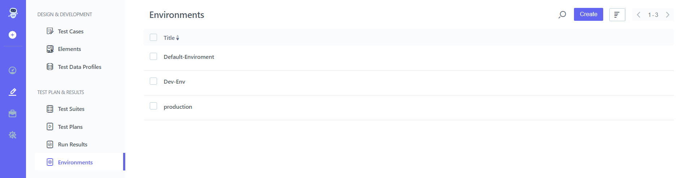
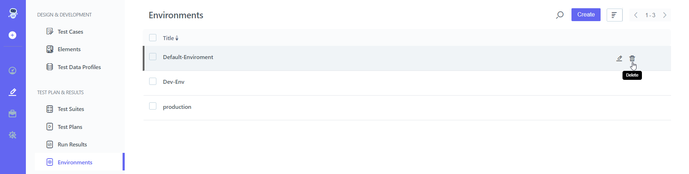

## 9.3 **Delete Environment** 

**Steps:** 

1. Go to **Portal** 
2. On the left-hand side, There Will Be A **Pencil Icon (Test Development)** Click on it 
3. Choose **Environments** From **Test Plan & Result**

4. **
   ` `You Can **Delete** Given **Environment**  
5. On the right-hand side There will Be A **Delete Icon**

6. Click on **Delete Icon** 

7. Click on **Yes, Delete**