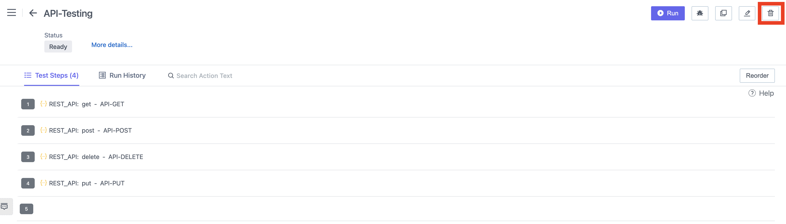

## Video
[Video](https://youtu.be/tT5vb14OhkQ)

## Steps

1. Go to **ContextQA Portal** 
2. On the left side there is the **Pencil Icon.** Click on it 
3. Choose a **Test case** From the Design And Development List 
4. The **Test cases** list will open as shown in the screenshot below 

5. To **Delete** a test case, click on **Checkbox** And then click on the **Delete Button** as shown in the screenshot below.

6. A New **Pop-up** will open as shown

7. Click on **Yes Delete** Button 
8. A message will be shown *Selected Test Case Deleted Successfully.*