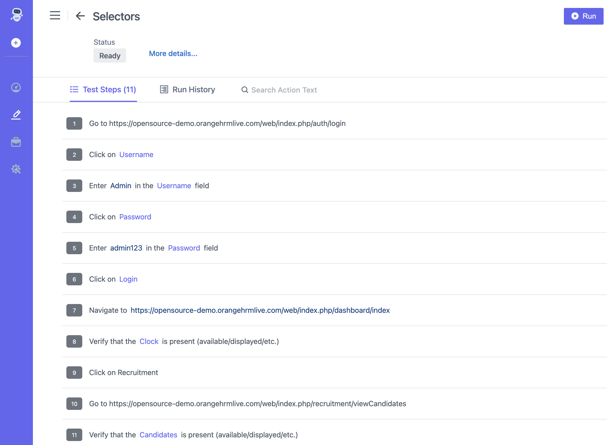

## Video
[Video](https://youtu.be/hJJa91jPoWo)

## Steps

1. Go to **ContextQA Portal.**
2. On the left hand side there is a **Pencil Icon.**
3. Choose a **Test case** from the Design And Development list and select a **Test Case** from the list of **Test Cases**.

4. On the right side, there is a **Pencil** Icon and click on it as shown.
5. **Edit Test Case** Screen is shown in Screenshot Above 

6. Edit **Name** and click on the **Update** button
7. Once the Test Case is edited, you will see a message at the bottom left- *Test case updated successfully*.

## Example

**Test Case: Verify Login and Recruitment Functionality in OrangeHRM**

## Objective
To ensure that the user can successfully log in to the OrangeHRM application, navigate to the Dashboard, and access the Recruitment section with the correct credentials.

## Test Steps
0. Go to https://opensource-demo.orangehrmlive.com/web/index.php/auth/login 
1. Click on Username 
2. Enter Admin in the Username field 
3. Click on Password 
4. Enter admin123 in the Password field 
5. Click on Login 
6. Navigate to https://opensource-demo.orangehrmlive.com/web/index.php/dashboard/index 
7. Verify that the Clock is present (available/displayed/etc.) 
9. Click on Recruitment 
10. Go to https://opensource-demo.orangehrmlive.com/web/index.php/recruitment/viewCandidates 
11. Verify that the Candidates is present (available/displayed/etc.) 

**Expected Outcome**
The user should be able to log in with the correct credentials, view the Clock on the Dashboard, navigate to the Recruitment section, and see the Candidates table without any issues.