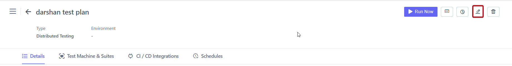
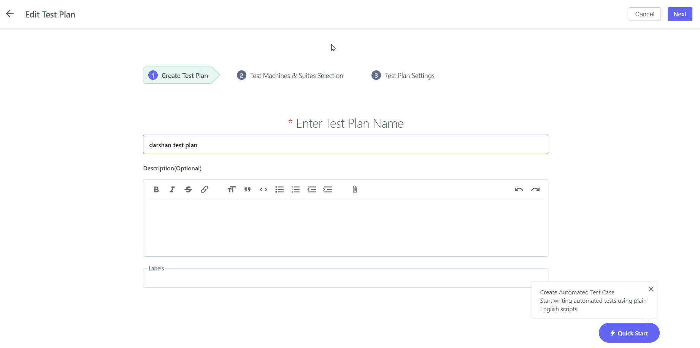

## 6.1  ** Edit Test Plan** 

**Steps**: 

1. Go to **ContextQA** **Portal** 
2. On the left-hand side There Will Be A **Pencil Icon.** Click on it 
3. Choose the **Test plan** from **Test Plan & Result** 
4. The **Test plan** List Will Open As Shown In the Screenshot Below

5. Select Given **Test Plan** 
6. On the right-hand Side There Is an **Edit** Tab Click on it 
7. 
8. Click on it 
9. Edit **Test Plan Name, Description, Labels** 

10. Click on **Next Button** 
11. Select **Test Suite** 

12. Click on **Add Machine Device** 

13. Edit **Name, Select OS, OS Version, Select Browser, Browser Version And Resolution.**
14. Click on **Create Button** 
