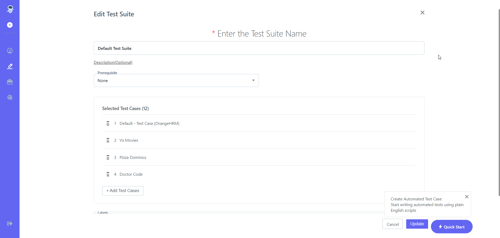

## 5.2 Edit Test Suite 
[**Video**](https://www.youtube.com/watch?v=CcYkOUTBQPg&list=PLfRq0FuuqhRnYtoF6kHsDdZc7ekSgpg6V&index=10)

Steps: 

1. Go to **Portal** 
1. On the Left Hand Side There Will Be A **Pencil Icon ( Test Development )**Click on it 
1. Choose **Test Suite** From **Test Plan & Result** 
1. Click On Given **Test Suite** 
1. **Test cases** List Will Open As Shown In the Screenshot Below 
1. 
1. On the Right Hand Side, There Is a Pencil **Icon.** Click on it.
1. **Edit Test Suite** Screen Open As Shown in the Screenshot Above.
1. 
1. Edit **Name, Prerequisite, Add Test cases, Add Labels** 
1. Click on **Update Tab** 
