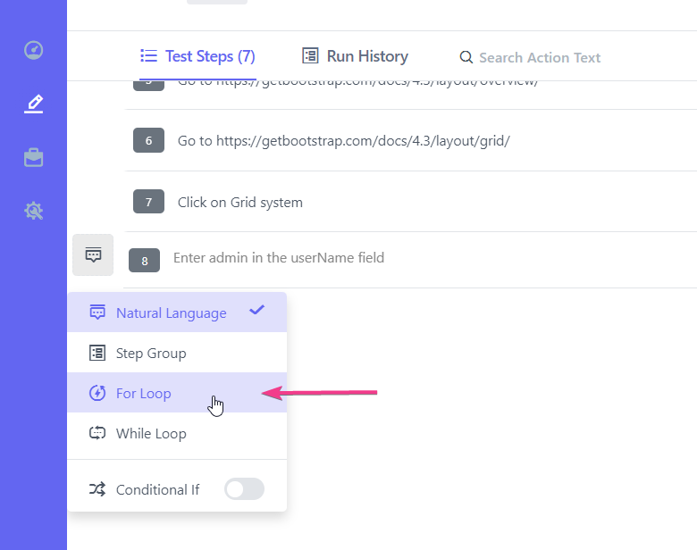
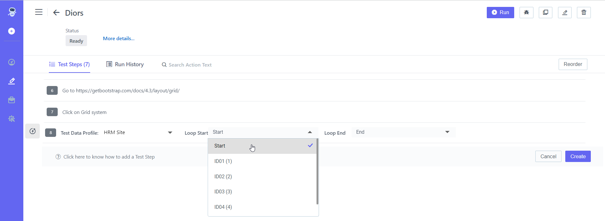

 ---
title: For Loop
intro: 'How to Create For Loop using Low-code'
topics:
  - ForLoop
---

## Create A For Loop
Here is the [Video](https://youtu.be/GE3mEDiPO0k)

1. Go to **ContextQA Portal** 
2. On the left side There Will Be a **Pencil Icon.** Click on it 
3. Choose a **Test case** From the Design And Development List 
4. The **Test cases** list will be displayed as shown below

5. Click on desired **Test Case**
6. **Test Steps** list will be displayed. 
7. Click on the option of Side Panel as shown

8. Select **For Loop** option (For Data- Driven Testing only this option is used)

9. Enter **Test Data Profile, Loop Start, Loop End** 

10. Click on **Create** Button 

